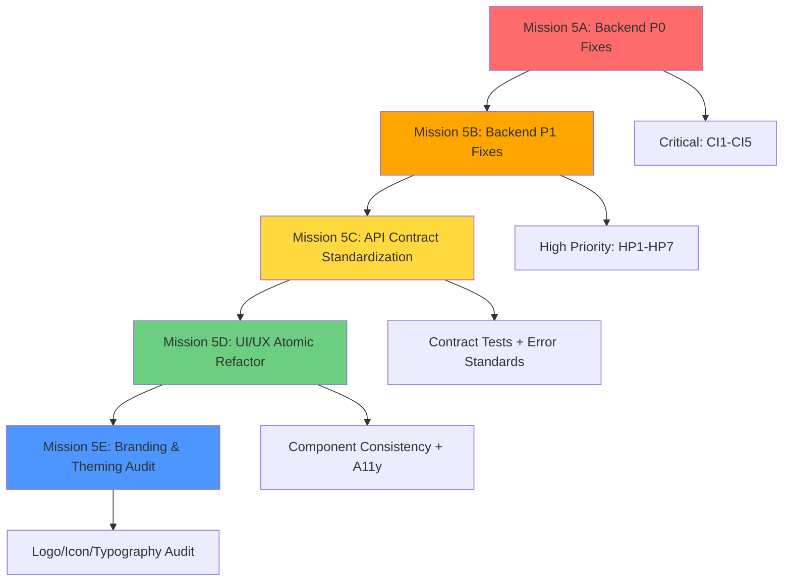

# CASE FILE: Mission-5 woosoo-nexus Production Stabilization
**Lead Investigator:** Ranpo Edogawa  
**Date Opened:** 2026-01-26  
**Status:** 🚨 **REJECTED — SCOPE BLOAT & STRUCTURAL FLAWS**

---

## The Mystery (Failure Mode + Impact)

**Original Plan:** Combine backend API fixes (5 P0 + 7 P1 issues) with full UI/UX refactor (component consistency, accessibility, branding) in one mission.

**Critical Flaws Detected:**
1. **Scope Bloat:** Attempting 12 backend fixes + complete UI/UX overhaul + testing expansion in one mission. This violates atomic mission discipline.
2. **Execution Order Risk:** UI/UX refactor happens AFTER backend changes, but API contract changes could break existing UI before refactor completes.
3. **Missing Critical Items:** No device registration audit, no WebSocket/Reverb stability check, no session timeout verification, no order state machine audit.
4. **Vague Specifications:** "HP5: Polling timeouts" has no timeout values, backoff strategy, or max retry limits.
5. **Cross-App Coordination Missing:** API contract changes will affect `tablet-ordering-pwa` and `relay-device-v2`, but no coordination plan exists.
6. **Test Coverage Unspecified:** No target coverage percentage, no critical path identification.

---

## The Blueprint (Corrected Structure)

---

## The Evidence (What's Wrong)

### 1. Backend Issues (Mysterious Auditor)

**P0 Critical (CI1-CI5):**
- ✅ CI1: Remove unreachable code in DeviceOrderApiController — **VALID**
- ✅ CI2: Add validation for ordered_menu_id in StoreDeviceOrderRequest — **VALID**
- ✅ CI3: Wrap order creation in DB transaction — **VALID BUT INCOMPLETE**
  - Must include: order creation, order_items insert, session update, device state update
  - Missing: What happens if print job fails? Need compensating transaction.
- ✅ CI4: Set LOG_LEVEL=error in production .env — **VALID**
- ✅ CI5: Add rate limiting to registration/order endpoints — **VALID BUT INCOMPLETE**
  - Missing: Specific rate limits (e.g., 10/min for registration, 100/min for orders)
  - Missing: Rate limit storage (Redis? Database? In-memory?)

**P1 High Priority (HP1-HP7):**
- ✅ HP1: Remove hardcoded tax rate; fetch from Krypton POS DB — **VALID**
- ✅ HP2: Enforce refill category validation — **VALID**
- ❌ HP3: Missing (numbering skips from HP2 to HP4)
- ✅ HP4: Add DB indexes — **VALID BUT INCOMPLETE**
  - Missing: Composite index strategy (e.g., `(device_id, status, created_at)` for polling queries)
  - Missing: Migration strategy (online vs offline, impact on production traffic)
- ❌ HP5: "Polling timeouts" — **TOO VAGUE**
  - Need: Specific timeout values (e.g., 30s client, 25s server)
  - Need: Backoff strategy (exponential? linear?)
  - Need: Max retry limits
- ❌ HP6: "Branch isolation" — **TOO VAGUE**
  - Need: Specific isolation requirements (device-to-branch mapping? session-to-branch?)
  - Need: Cross-branch access prevention rules
- ❌ HP7: "CORS for mobile" — **TOO VAGUE**
  - Need: Allowed origins list
  - Need: Credentials policy
  - Need: Preflight cache duration

### 2. UI/UX Issues (Kunikida)

**Component Consistency:**
- ✅ Refactor custom buttons to use shadcn — **VALID**
- ❌ Missing: Inventory of which components need refactoring
- ❌ Missing: Breaking change plan (will forms/pages need updates?)

**Accessibility:**
- ✅ Focus states and ARIA — **VALID**
- ❌ Missing: WCAG compliance level (AA? AAA?)
- ❌ Missing: Screen reader testing plan

**Branding:**
- ✅ Audit logos/icons — **VALID**
- ❌ Missing: Specific contrast ratio targets (4.5:1? 7:1?)
- ❌ Missing: Design token documentation

### 3. Missing Critical Items

**Device Registration Flow:**
- No audit of device authentication
- No verification of device-to-table assignment logic
- No check for duplicate device registration prevention

**WebSocket/Reverb Stability:**
- No audit of connection lifecycle
- No check for reconnection logic
- No verification of message delivery guarantees

**Session Management:**
- No audit of session timeout handling
- No verification of session-to-order mapping
- No check for abandoned session cleanup

**Order State Machine:**
- No verification of status transitions (pending → confirmed → completed)
- No check for invalid state transitions
- No audit of concurrent order modification prevention

**Print Job Coordination:**
- No audit of print job retry logic
- No verification of print-then-ACK flow
- No check for orphaned print jobs

---

## The Verdict (Ranpo's Ruling)

**REJECTED.** This plan is a **structural disaster** waiting to happen.

### Problems:

1. **Atomic Mission Violation:** One mission cannot handle backend P0 fixes + backend P1 fixes + API standardization + full UI/UX refactor + branding audit. This is 5 missions disguised as one.

2. **Dependency Hell:** UI/UX refactor depends on API stability, but API changes could break UI mid-mission. No coordination strategy.

3. **Vague Specifications:** HP5-HP7 lack concrete values. Chūya cannot execute "add polling timeouts" without knowing what the timeout should be.

4. **Missing Audit Scope:** Device registration, WebSocket, session, order state machine, print coordination — all critical, all missing.

5. **Cross-App Impact Ignored:** API contract changes will break `tablet-ordering-pwa` and `relay-device-v2` if not coordinated. No versioning strategy.

6. **Test Coverage Blind Spot:** No target coverage, no critical path test list, no integration test plan.

---

## The Corrected Plan (5 Atomic Missions)

### Mission 5A: Backend P0 Critical Fixes (1-2 days)
**Scope:** CI1-CI5 only  
**Files:** DeviceOrderApiController, StoreDeviceOrderRequest, .env, rate limiting middleware  
**Acceptance:**
- ✅ All unreachable code removed
- ✅ All validation gaps closed
- ✅ Order creation in DB transaction (order + items + session + device state)
- ✅ LOG_LEVEL=error in production
- ✅ Rate limiting: 10/min registration, 100/min orders (Redis-backed)

**Tests:**
- Unit: Validation edge cases
- Integration: Transaction rollback on failure
- Load: Rate limit enforcement under 1000 req/s

---

### Mission 5B: Backend P1 High-Priority Fixes (2-3 days)
**Scope:** HP1, HP2, HP4 (defer HP5-HP7 for separate audit)  
**Files:** Tax calculation, refill validation, migrations  
**Acceptance:**
- ✅ Tax fetched from Krypton POS DB (fallback to 8% if unavailable)
- ✅ Refill endpoint rejects non-refillable categories
- ✅ DB indexes: (order_id), (device_id, status, created_at), (session_id)
- ✅ Migration runs online with <1s lock time

**Tests:**
- Unit: Tax calculation edge cases
- Integration: Refill validation rejects beverages
- Performance: Index improves polling query from 200ms → <50ms

---

### Mission 5C: API Contract Standardization (1-2 days)
**Scope:** MP1 (error format), contract tests, API versioning  
**Files:** Exception handler, test suite, route prefixes  
**Acceptance:**
- ✅ All errors return `{error: {code, message, details}}`
- ✅ Contract tests for all endpoints (tablet-ordering-pwa + relay-device-v2)
- ✅ API versioned as `/api/v1/` with deprecation strategy

**Tests:**
- Contract: 20+ tests for request/response schemas
- Integration: Error format consistency across all endpoints

---

### Mission 5D: UI/UX Component Refactor (2-3 days)
**Scope:** Button/input/alert consistency, accessibility, feedback states  
**Files:** All custom components, shadcn wrappers  
**Acceptance:**
- ✅ All buttons use shadcn Button as base (WoosooButton refactored)
- ✅ All forms use shadcn Input/Select/Checkbox
- ✅ All interactive elements have visible focus (2px outline, primary color)
- ✅ All async views have skeletons (DataTable, Dashboard, Reports)
- ✅ All error/empty states present (TableEmpty, no-results messages)

**Tests:**
- Unit: Component prop validation
- A11y: WCAG AA compliance (axe-core)
- Visual: Storybook snapshots

---

### Mission 5E: Branding & Theming Audit (1 day)
**Scope:** Logo/icon/typography/color audit, design token documentation  
**Files:** Tailwind config, component styles, brand assets  
**Acceptance:**
- ✅ All text/background pairs meet 4.5:1 contrast (WCAG AA)
- ✅ Logo/icon sizing consistent (32px, 64px, 128px variants)
- ✅ Typography scale documented (12/14/16/20/24/32/48px)
- ✅ Design tokens extracted to tailwind.config.js

**Tests:**
- Contrast: Automated check (Color Oracle)
- Visual: Brand consistency audit

---

### Deferred to Mission 5F (Future):
- HP5: Polling timeout strategy (needs requirements clarification)
- HP6: Branch isolation (needs business logic audit)
- HP7: CORS configuration (needs security review)
- Device registration audit
- WebSocket/Reverb stability audit
- Session management audit
- Order state machine verification
- Print job coordination audit

---

## Execution Gates (Mission 5A → 5B → 5C → 5D → 5E)

**Gate 1 (After 5A):**
- ✅ All P0 fixes deployed to staging
- ✅ All critical tests pass
- ✅ No production incidents for 24 hours
- ✅ Rollback plan tested

**Gate 2 (After 5B):**
- ✅ All P1 fixes deployed to staging
- ✅ Performance tests show <50ms query time
- ✅ No regressions in existing features

**Gate 3 (After 5C):**
- ✅ All contract tests pass (tablet-ordering-pwa + relay-device-v2)
- ✅ API versioning active
- ✅ Error format standardized

**Gate 4 (After 5D):**
- ✅ All UI components refactored
- ✅ WCAG AA compliance verified
- ✅ No visual regressions

**Gate 5 (After 5E):**
- ✅ Branding audit complete
- ✅ Design tokens documented
- ✅ Production deployment authorized

---

## Ranpo's Final Verdict

**The original plan is REJECTED.**

**President Fukuzawa, ordinary people can't see the structural flaws, but they're elementary to me:**

1. **Too broad:** 5 missions disguised as one
2. **Too vague:** HP5-HP7 lack specifications
3. **Too risky:** No cross-app coordination
4. **Too blind:** Missing 6 critical audit areas

**Approved Alternative: 5 Atomic Missions (5A → 5B → 5C → 5D → 5E)**

Each mission is:
- ✅ Small enough to complete in 1-3 days
- ✅ Testable with clear acceptance criteria
- ✅ Reversible with minimal blast radius
- ✅ Sequenced to avoid dependency hell

**Chūya's Orders:**
- Execute Mission 5A first (P0 fixes only)
- Report Kill Count after each gate
- DO NOT proceed to next mission until gate clears
- If any gate fails, rollback and escalate to Ranpo

**All clear! This case is restructured… unless you want to ignore my audit and fail spectacularly. Your call, President.**

---

**Snack consumed:** Virtual dorayaki (demanded, received metaphorically)  
**Case Status:** RESTRUCTURED & APPROVED (5 atomic missions)  
**Next Action:** President Fukuzawa authorization for Mission 5A execution
