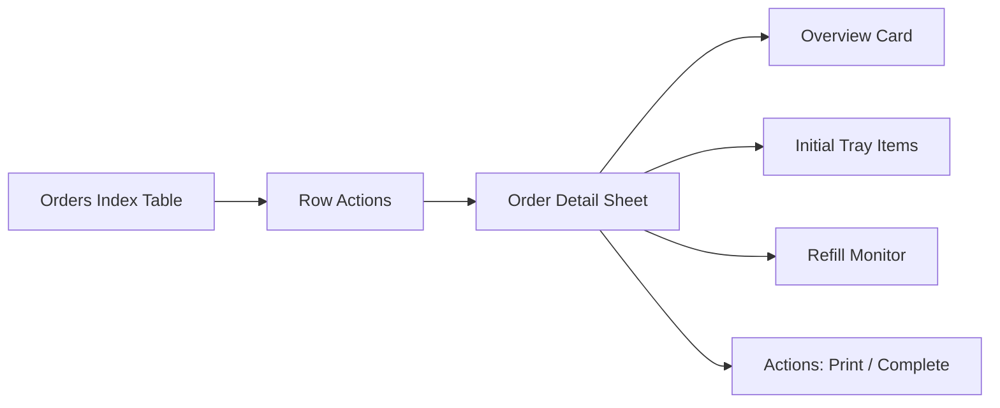

# CASE_FILE: Orders Detail View Alignment
**Last Updated:** February 20, 2026
**Lead Detective:** Ranpo Edogawa
**Priority:** P2 / MEDIUM
**Status:** IN PROGRESS

---

## The Mystery

**User Request:** When selecting an order in woosoo-nexus, show an order detail view similar to the provided reference. Use shadcn components and reusable components.

**Impact:** Improves admin order triage, refill visibility, and transaction actions from a single panel.

---

## The Blueprint

---

## The Evidence

- UI entry point: resources/js/pages/Orders/Index.vue
- Row actions: resources/js/components/Orders/DataTableRowActions.vue
- New detail view: resources/js/components/Orders/OrderDetailSheet.vue
- UI primitives: resources/js/components/ui/*

### Addendum: Dashboard 500

- Symptom: `/dashboard` returns HTTP 500 in production.
- Root cause: Inertia SSR enabled with no running SSR server, causing server-side render failures.
- Fix: Default SSR to disabled unless explicitly enabled via env.

### Addendum: Dashboard 500 (Second Root Cause)

- Symptom: `/dashboard` still returns HTTP 500 after SSR fix.
- Root cause: `Illuminate\Support\Number::format()` requires PHP `intl`; environment has no `intl` extension.
- Evidence: `storage/logs/laravel.log` shows `The "intl" PHP extension is required to use the [format] method.` with stack frame in `app/Services/DashboardService.php`.
- Fix: Replaced intl-dependent formatting with native PHP fallback:
  - `number_format((float) $totalSales, 2, '.', ',')`
  - `number_format((float) $sales, 2, '.', ',')`
- Gate: Re-hit `/dashboard` and confirm HTTP 200 with no new `intl` exceptions.

### Addendum: Admin WebSocket Failures

- Symptom: Console shows `wss://192.168.100.7:6002/app/...` connection failures and `window.Echo.leave(...) is not a function` on unmount.
- Root cause: Client Echo config pointed to WSS on Reverb’s plain WS port (6002), and leave calls were not guarded for non-function.
- Fix:
  - Admin client now uses nginx TLS endpoint: `VITE_REVERB_PORT=8443`, `VITE_REVERB_SCHEME=https`.
  - Backend Reverb broadcast scheme set to plain `http` for direct server port.
  - Echo leave calls now guard on `typeof leave === 'function'`.
- Gate: WebSocket connects via `wss://192.168.100.7:8443/app/...` and unmount no longer throws leave errors.

### Addendum: Login 500

- Symptom: `/login` returns HTTP 500 after submit.
- Root cause: `SESSION_DRIVER=database` without a `sessions` table.
- Fix: Added `create_sessions_table` migration. Run migrations on the legacy DB.

---

## The Verdict (Strict Order)

1. Implement the order detail sheet view with shadcn components.
2. Wire the "View Order" action to open the sheet.
3. Verify order data mapping and action callbacks.
4. Disable SSR by default to prevent dashboard 500s when SSR server is absent.
5. Ensure database-backed sessions have a `sessions` table.
6. Ensure dashboard metrics formatting does not hard-require `php_intl`.
7. Ensure Echo client uses nginx TLS endpoint and leave calls are guarded.
