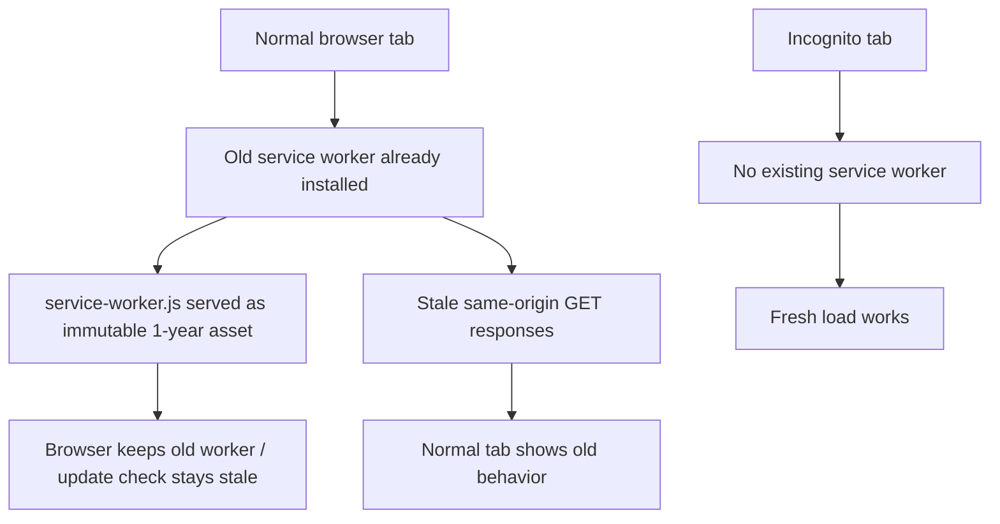
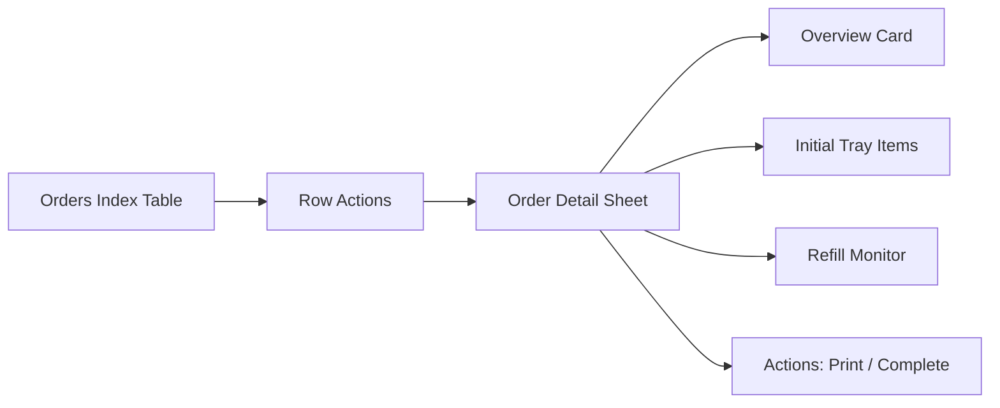

# CASE FILE — Stale browser cache / service worker persistence

## Summary

Normal browser tabs were serving stale app behavior while incognito worked. The issue is not Laravel `optimize`; it is a stale browser cache layer, specifically a service worker plus a long-lived immutable cache rule for `service-worker.js`.

## Evidence

- `woosoo-nexus/public/service-worker.js` exists and caches same-origin `GET` responses.
- `woosoo-nexus/docker/nginx/default.conf` serves `*.js` with `expires 1y` and `Cache-Control: public, immutable`.
- Runtime header check for `http://127.0.0.1:8000/service-worker.js` returned:
  - `Cache-Control: max-age=31536000`
  - `Cache-Control: public, immutable`
- Incognito works, which strongly indicates the problem is client-side cached state rather than backend logic.

## Root Cause

The browser can keep an outdated service worker script and its cached responses for a long time because the worker file itself is served as an immutable one-year asset. Once a normal tab has an old worker, that worker can continue serving stale same-origin GET responses.

## Solution

1. Stop long-term caching for `/service-worker.js`.
2. Make the worker clear stale caches and unregister itself.
3. Keep static asset caching for real build artifacts, but exclude the worker bootstrap file.

## Mermaid

```mermaid
flowchart TD
    A[Normal browser tab] --> B[Old service worker already installed]
    B --> C[service-worker.js served as immutable 1-year asset]
    C --> D[Browser keeps old worker / update check stays stale]
    B --> E[Stale same-origin GET responses]
    E --> F[Normal tab shows old behavior]
    G[Incognito tab] --> H[No existing service worker]
    H --> I[Fresh load works]
```

## Validation Plan

- Re-check response headers for `/service-worker.js` after the nginx change.
- Confirm the worker no longer caches app responses.
- Verify a normal browser tab after clearing site data or reloading the updated worker.

### Addendum: Monitoring card false zero for unprinted orders (April 29, 2026)

- Symptom: `System Monitoring` showed `Unprinted Orders = 0` while at least one pending unprinted order existed.
- Root cause: `app/Http/Controllers/Admin/MonitoringController.php` filtered with uppercase literals `['PENDING', 'CONFIRMED']` while canonical `OrderStatus` values are lowercase (`pending`, `confirmed`).
- Fix: switched filter to enum-backed canonical values:
  - `OrderStatus::PENDING->value`
  - `OrderStatus::CONFIRMED->value`
- Regression coverage added: `tests/Feature/Admin/MonitoringMetricsTest.php` asserts that a lowercase pending unprinted order is returned by `/monitoring/metrics`.
- Validation note: local test runner currently blocks on an interactive `migrate:fresh` confirmation path in this environment (`askQuestion` Mockery failure), so automated pass/fail evidence is pending environment normalization.
# CASE_FILE: Orders Detail View Alignment
**Last Updated:** March 25, 2026
**Lead Detective:** Ranpo Edogawa
**Priority:** P2 / MEDIUM
**Status:** ✅ CLOSED

---

## The Mystery

**User Request:** When selecting an order in woosoo-nexus, show an order detail view similar to the provided reference. Use shadcn components and reusable components.

**Impact:** Improves admin order triage, refill visibility, and transaction actions from a single panel.

---

## The Blueprint

```mermaid
flowchart LR
  A[Orders Index Table] --> B[Row Actions]
  B --> C[Order Detail Sheet]
  C --> D[Overview Card]
  C --> E[Initial Tray Items]
  C --> F[Refill Monitor]
  C --> G[Actions: Print / Complete]
```

---

## The Evidence

- UI entry point: resources/js/pages/Orders/Index.vue
- Row actions: resources/js/components/Orders/DataTableRowActions.vue
- New detail view: resources/js/components/Orders/OrderDetailSheet.vue
- UI primitives: resources/js/components/ui/*

### Addendum: Transaction Stability Carry-Forward (April 23, 2026)

- Preserved device order error contract for missing POS session as `503` + `SESSION_NOT_FOUND` semantics.
- Added explicit POS-unavailable mapping for relevant DB connection failures to avoid ambiguous client behavior.
- Verified `/docs/api` production availability fix via runtime cache-flow correction.
- Verified admin fallback behavior for Krypton/POS-unavailable paths to avoid hard failures in key pages.

**Learnings captured**
- Keep external transaction contracts stable while hardening backend internals.
- Prefer superseding clean branches over merging mixed/superseded branches with scope drift.
- Validate both source and served runtime behavior before declaring a fix complete.

### Addendum: Dashboard 500

- Symptom: `/dashboard` returns HTTP 500 in production.
- Root cause: Inertia SSR enabled with no running SSR server, causing server-side render failures.
- Fix: Default SSR to disabled unless explicitly enabled via env.

### Addendum: Dashboard 500 (Second Root Cause)

- Symptom: `/dashboard` still returns HTTP 500 after SSR fix.
- Root cause: `Illuminate\Support\Number::format()` requires PHP `intl`; environment has no `intl` extension.
- Evidence: `storage/logs/laravel.log` shows `The "intl" PHP extension is required to use the [format] method.` with stack frame in `app/Services/DashboardService.php`.
- Fix: Replaced intl-dependent formatting with native PHP fallback:
  - `number_format((float) $totalSales, 2, '.', ',')`
  - `number_format((float) $sales, 2, '.', ',')`
- Gate: Re-hit `/dashboard` and confirm HTTP 200 with no new `intl` exceptions.

### Addendum: Admin WebSocket Failures

- Symptom: Console shows `wss://192.168.100.7:6002/app/...` connection failures and `window.Echo.leave(...) is not a function` on unmount.
- Root cause: Client Echo config pointed to WSS on Reverb’s plain WS port (6002), and leave calls were not guarded for non-function.
- Fix:
  - Admin client now uses nginx TLS endpoint: `VITE_REVERB_PORT=8443`, `VITE_REVERB_SCHEME=https`.
  - Backend Reverb broadcast scheme set to plain `http` for direct server port.
  - Echo leave calls now guard on `typeof leave === 'function'`.
- Gate: WebSocket connects via `wss://192.168.100.7:8443/app/...` and unmount no longer throws leave errors.

### Addendum: Login 500

- Symptom: `/login` returns HTTP 500 after submit.
- Root cause: `SESSION_DRIVER=database` without a `sessions` table.
- Fix: Added `create_sessions_table` migration. Run migrations on the legacy DB.

### Addendum: Phase 4 Admin UX Cleanup

- Scope: `apps/woosoo-nexus/**` only. No root-level or cross-app changes required.
- L3 Event Logs: added in-page search and severity filtering to reduce operator scanning time on sanitized logs.
- L4 Profile Settings: added a warning banner when the account still uses `admin@example.com`; seeder now supports `INITIAL_ADMIN_EMAIL` and `INITIAL_ADMIN_NAME` overrides.
- L5 Reverb Status: normalized NSSM output at the controller boundary so raw `SERVICE_*` values map cleanly to `running`, `stopped`, and `paused`.
- L6 Sidebar Theme: corrected light-theme sidebar tokens in `resources/css/app.css`; the sidebar now follows the active appearance mode instead of rendering dark by default.
- L7 Letter Spacing / Raw State Leakage: frontend and backend both normalize service status before rendering, preventing raw `SERVICE_STOPPED` text from surfacing in the badge UI.

- Manual audit gates:
  1. `/event-logs` filters by search term and level with no console errors.
  2. `/settings/profile` shows the warning banner when the admin email remains the default placeholder.
  3. `/reverb` displays `Stopped` or `Running` badges instead of raw NSSM service constants.
  4. `/dashboard` and sidebar navigation visually switch between light and dark appearances.

### Addendum: Permissions Route Miswire

- Symptom: `/permissions` rendered the role-assignment screen instead of a permission registry, so the page could not create or delete permissions through the existing CRUD backend.
- Root cause: `PermissionController@index` rendered `roles/Permissions`, a page built for syncing permissions onto a selected role and expecting role-specific props not provided by the controller.
- Fix:
  - Added a dedicated Inertia page at `resources/js/pages/Permissions/Index.vue` for permission creation, search, selection, and deletion.
  - Updated `PermissionController@index` to render `Permissions/Index` and include `roles_count` so operators can see current usage before deleting a permission.
  - Verified route bindings with `php artisan route:list --name=permissions`.
- Gate:
  1. `/permissions` loads a permission registry instead of the role-sync screen.
  2. Creating a permission with `web` or `api` guard succeeds and refreshes the table.
  3. Single delete removes one permission and bulk delete removes all selected permissions.
  4. Existing role permission assignment still works from `/roles` or `/accessibility`.

### Addendum: Order Detail Verification

- Symptom: `DataTableRowActions.vue` "View Order" dropdown rendered its own `OrderDetailSheet` per row without fetching full order data. Because `OrderController@index` only eager-loads `device` and `table` (not `items`), the per-row sheet always showed empty item lists.
- Root cause: The row-level `openViewDialog` set `viewDialogOrder` directly from the row projection, which has an empty `items: []` array on the list endpoint. The page-level `openOrderDetail` already handles this via background fetch to `/device-order/by-order-id/{id}`.
- Fix:
  - Added background fetch inside `openViewDialog` in `DataTableRowActions.vue` matching the `openOrderDetail` pattern from `Index.vue`.
  - Sheet opens immediately with row data (non-blocking), then silently upgrades to fully-loaded order once the fetch resolves.
  - Fixed duplicate `status` field in `DeviceOrder` interface (was declaring both `status: OrderStatus` and `status: string`).
  - Added missing financial fields (`subtotal`, `sub_total`, `tax`) and alias fields (`orderedMenus`, `order_items`) to `DeviceOrder` that `OrderDetailSheet` already references.
- Gate:
  1. Click "View Order" from row actions dropdown → sheet shows items after short background fetch.
  2. Click a table row directly → same sheet model, verified to load immediately.
  3. TypeScript diagnostics clean on `models.d.ts`, `DataTableRowActions.vue`, `OrderDetailSheet.vue`, and `Orders/Index.vue`.

---

## The Verdict (Strict Order)

1. ✅ Implement the order detail sheet view with shadcn components.
2. ✅ Wire the "View Order" action to open the sheet.
3. ✅ Verify order data mapping and action callbacks.
4. ✅ Disable SSR by default to prevent dashboard 500s when SSR server is absent.
5. ✅ Ensure database-backed sessions have a `sessions` table.
6. ✅ Ensure dashboard metrics formatting does not hard-require `php_intl`.
7. ✅ Ensure Echo client uses nginx TLS endpoint and leave calls are guarded.
