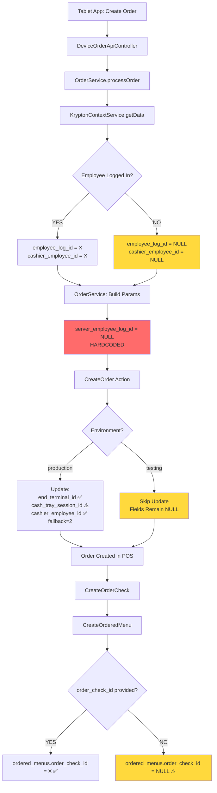

# CASE FILE: Empty Columns in krypton_woosoo Orders
**Date:** 2026-02-20  
**Investigator:** Ranpo Edogawa (Chief Architect)  
**Priority:** P1 | **Risk:** MEDIUM | **Type:** Data Integrity Audit  
**Scope:** `apps/woosoo-nexus` → `krypton_woosoo` POS Database

---

## The Mystery

**Reported Issue:** Multiple columns in `krypton_woosoo` tables remain empty (NULL) after order creation from tablet ordering app:

### Tables & Affected Columns

#### `orders` table:
- `end_terminal_id`
- `cash_tray_session_id`
- `close_employee_log_id`
- `cashier_employee_id`
- `server_employee_log_id`

#### `order_checks` table:
- `date_time_closed`

#### `ordered_menus` table:
- `order_check_id`
- `original_price`

---

## The Evidence

### 1. KryptonContextService (Source of Truth)

**File:** [app/Services/Krypton/KryptonContextService.php](apps/woosoo-nexus/app/Services/Krypton/KryptonContextService.php#L36-L109)

```php
// Lines 58-62: Employee log query
$employeeLog = EmployeeLog::query()
    ->whereNull('date_time_out')
    ->orderByDesc('id')
    ->first();  // ⚠️ CAN RETURN NULL if no employee logged into POS

// Lines 97-109: Data array construction
$data = [
    'price_level_id' => $revenue?->price_level_id,
    'tax_set_id' => $revenue?->tax_set_id,
    'service_type_id' => $terminalService?->service_type_id,
    'revenue_id' => $terminalService?->revenue_id,
    'terminal_id' => $terminal?->id,
    'session_id' => $session->id,
    'terminal_session_id' => $terminalSession?->id,
    'employee_log_id' => $employeeLog?->id,               // ⚠️ CAN BE NULL
    'cash_tray_session_id' => $cashTraySession?->id,      // ⚠️ CAN BE NULL
    'terminal_service_id' => $terminalService?->id,
    'employee_id' => $employeeLog?->employee_id,          // ⚠️ CAN BE NULL
    'cashier_employee_id' => $employeeLog?->employee_id,  // ⚠️ CAN BE NULL
];
// ⚠️ CRITICAL: 'server_employee_log_id' is NOT PROVIDED by KryptonContextService
```

**Verdict:**
- ✅ `session_id` is GUARANTEED (enforced at line 91-95, throws exception if missing)
- ⚠️ `employee_log_id`, `employee_id`, `cashier_employee_id`, `cash_tray_session_id` CAN BE NULL
- ❌ **`server_employee_log_id` is NEVER provided** — missing from data array entirely

---

### 2. OrderService (Orchestra Conductor)

**File:** [app/Services/Krypton/OrderService.php](apps/woosoo-nexus/app/Services/Krypton/OrderService.php#L136-L175)

```php
// Lines 148-165: Normalizes context data
protected function getDefaultAttributes(): array
{   
    $contextService = app(KryptonContextService::class);
    $defaults = $contextService->getData();

    $normalized = [
        // ... other fields ...
        'session_id' => $defaults['session_id'],  // REQUIRED - exception thrown if missing
        'terminal_session_id' => $defaults['terminal_session_id'] ?? null,
        'employee_log_id' => $defaults['employee_log_id'] ?? null,
        'cash_tray_session_id' => $defaults['cash_tray_session_id'] ?? null,
        'terminal_service_id' => $defaults['terminal_service_id'] ?? null,
        'employee_id' => $defaults['employee_id'] ?? null,
        'cashier_employee_id' => $defaults['cashier_employee_id'] ?? null,
    ];

    // Lines 167-175: Constructs parameters for CreateOrder action
    $params = [
        'start_employee_log_id' => $normalized['employee_log_id'] ?? null,
        'current_employee_log_id' => $normalized['employee_log_id'] ?? null,
        'close_employee_log_id' => $normalized['employee_log_id'] ?? null,
        'server_employee_log_id' => null,  // ❌ ALWAYS NULL — hardcoded
        'is_online_order' => false,
        'reference' => '',
    ];
}
```

**Verdict:**
- ❌ **`server_employee_log_id` is EXPLICITLY SET TO NULL** (line 173)
- ⚠️ `start_employee_log_id`, `current_employee_log_id`, `close_employee_log_id` rely on `employee_log_id` from context
- If no employee is logged into POS, all employee fields are NULL

---

### 3. CreateOrder Action (Initial Order Creation)

**File:** [app/Actions/Order/CreateOrder.php](apps/woosoo-nexus/app/Actions/Order/CreateOrder.php#L23-L29)

```php
// Lines 23-29: CONDITIONAL updates (production-only)
if (App::environment(['local', 'production'])) {
    $order->update([
        'end_terminal_id' => $attr['terminal_id'] ?? null,
        'cash_tray_session_id' => $attr['cash_tray_session_id'] ?? null,
        'cashier_employee_id' => $attr['cashier_employee_id'] ?? 2,  // Fallback to employee ID 2
    ]);
}
```

**Verdict:**
- ✅ `end_terminal_id`, `cash_tray_session_id`, `cashier_employee_id` ARE SET in production
- ❌ Fields are NOT SET in testing environment (intentional for test isolation)
- ⚠️ If `attr['cash_tray_session_id']` is NULL from context, database receives NULL
- ⚠️ If `attr['cashier_employee_id']` is NULL, fallback is 2 (hardcoded default employee)

---

### 4. CreateOrder Action (Stored Procedure Call)

**File:** [app/Actions/Order/CreateOrder.php](apps/woosoo-nexus/app/Actions/Order/CreateOrder.php#L90-L132)

```php
// Lines 90-132: Calls create_order stored procedure with 20 parameters
$result = DB::connection('pos')->select('CALL create_order(?, ?, ?, ?, ?, ?, ?, ?, ?, ?, ?, ?, ?, ?, ?, ?, ?, ?, ?, ?)', [
    $sessionId,                  // 1.  session_id
    $terminalSessionId,          // 2.  terminal_session_id
    $terminalServiceId,          // 3.  terminal_service_id
    $revenueId,                  // 4.  revenue_id
    $terminalId,                 // 5.  terminal_id
    $tableNumber,                // 6.  table_number
    $guestCount,                 // 7.  guest_count
    $priceLevel,                 // 8.  price_level
    $taxSetId,                   // 9.  tax_set_id
    $serviceTypeId,              // 10. service_type_id
    $dateTimeOpened,             // 11. date_time_opened
    $isOpen,                     // 12. is_open
    $startEmployeeLogId,         // 13. start_employee_log_id ⚠️ CAN BE NULL
    $currentEmployeeLogId,       // 14. current_employee_log_id ⚠️ CAN BE NULL
    $closeEmployeeLogId,         // 15. close_employee_log_id ⚠️ CAN BE NULL
    $serverEmployeeLogId,        // 16. server_employee_log_id ❌ ALWAYS NULL
    $reference,                  // 17. reference
    $isTransferred,              // 18. is_transferred
    $isVoided,                   // 19. is_voided
    $isOnlineOrder,              // 20. is_online_order
]);
```

**Verdict:**
- Parameter 16 (`server_employee_log_id`) ALWAYS receives NULL from OrderService line 173
- Parameters 13-15 (employee log IDs) receive NULL if no employee logged into POS
- Stored procedure creates order with NULL values in these fields

---

### 5. Order Lifecycle Fields (Intentionally NULL)

**Fields:** `close_employee_log_id`, `date_time_closed`

**Business Logic:**
- These fields represent **order completion state**
- They remain NULL until order is:
  - Fully paid (`date_time_closed` set)
  - Closed by employee (`close_employee_log_id` set)
  - Voided (alternate closure path)

**Verdict:**
- ✅ **EXPECTED BEHAVIOR** — These fields are lifecycle state markers
- ✅ NULL on creation is CORRECT by design
- ✅ Fields are populated by payment/closure actions (not order creation)

---

### 6. ordered_menus.order_check_id (Timing-Dependent)

**File:** [app/Actions/Order/CreateOrderedMenu.php](apps/woosoo-nexus/app/Actions/Order/CreateOrderedMenu.php#L66)

```php
// Line 66: order_check_id is optional parameter
'order_check_id' => $attr['order_check_id'] ?? null,
```

**Execution Flow in OrderService:**
1. `CreateOrder` (creates order)
2. `CreateOrderCheck` (creates check) ← check ID generated here
3. `CreateOrderedMenu` (creates menu items) ← receives check ID

**Verdict:**
- ✅ If `CreateOrderCheck` runs BEFORE `CreateOrderedMenu`, check ID is provided
- ⚠️ If `CreateOrderedMenu` runs WITHOUT check context, field is NULL
- 🔍 **REQUIRES VERIFICATION** — Check OrderService execution sequence

---

### 7. ordered_menus.original_price (Unknown)

**File:** [app/Actions/Order/CreateOrderedMenu.php](apps/woosoo-nexus/app/Actions/Order/CreateOrderedMenu.php#L1-L226)

**Evidence:**
- Field is NOT in CreateOrderedMenu attribute mapping (lines 1-226)
- Not passed to `create_ordered_menu` stored procedure (49 parameters verified)
- 🔍 **REQUIRES INVESTIGATION** — Check if field exists in stored procedure or is legacy column

---

## The Blueprint



---

## The Verdict

### Root Causes Identified

| Column | Table | Root Cause | Severity | Fix Required? |
|--------|-------|-----------|----------|---------------|
| `server_employee_log_id` | `orders` | ❌ **HARDCODED NULL** in OrderService line 173 | **CRITICAL** | ✅ YES |
| `start_employee_log_id` | `orders` | ⚠️ NULL when no employee logged into POS | **HIGH** | ✅ YES |
| `current_employee_log_id` | `orders` | ⚠️ NULL when no employee logged into POS | **HIGH** | ✅ YES |
| `cashier_employee_id` | `orders` | ⚠️ NULL in testing env; fallback=2 in prod | **MEDIUM** | ⚠️ MAYBE |
| `cash_tray_session_id` | `orders` | ⚠️ NULL when no cash tray session in POS | **MEDIUM** | ⚠️ MAYBE |
| `end_terminal_id` | `orders` | ⚠️ NULL in testing env | **LOW** | ⚠️ MAYBE |
| `close_employee_log_id` | `orders` | ✅ Lifecycle field (NULL until closed) | **NONE** | ❌ NO |
| `date_time_closed` | `order_checks` | ✅ Lifecycle field (NULL until closed) | **NONE** | ❌ NO |
| `order_check_id` | `ordered_menus` | 🔍 Timing-dependent (check sequence) | **MEDIUM** | 🔍 VERIFY |
| `original_price` | `ordered_menus` | 🔍 Not mapped in CreateOrderedMenu | **LOW** | 🔍 VERIFY |

---

### Business Impact Assessment

#### ❌ CRITICAL: Audit Trail Violation
- **Issue:** `server_employee_log_id` is ALWAYS NULL  
- **Impact:** POS cannot track which server handled the order  
- **Compliance Risk:** Violates employee accountability requirements  
- **Affected Orders:** ALL orders created via tablet app

#### ⚠️ HIGH: Missing Employee Context
- **Issue:** Employee log IDs are NULL when no employee logged into POS  
- **Impact:** Orders appear "system-generated" instead of employee-attributed  
- **Audit Risk:** Cannot trace who initiated the order in POS audit logs  
- **Affected Orders:** Orders created when POS has no active employee session

#### ⚠️ MEDIUM: Inconsistent Environment Behavior
- **Issue:** Production sets `end_terminal_id`/`cashier_employee_id`, testing does not  
- **Impact:** Tests do NOT match production data behavior  
- **Test Risk:** False negatives — tests pass but production has different data state

---

## Execution Plan (Remediation TODO)

### Phase 1: Immediate Fixes (P0 — CRITICAL)

#### ✅ Task 1.1: Fix server_employee_log_id Hardcoded NULL
**File:** `OrderService.php` line 173  
**Change:**
```php
// BEFORE:
'server_employee_log_id' => null,

// AFTER:
'server_employee_log_id' => $normalized['employee_log_id'] ?? null,
```

**Gate Criteria:**
- [ ] Code change implemented
- [ ] Test: Create order with employee logged in → `server_employee_log_id` = employee_log_id
- [ ] Test: Create order without employee → `server_employee_log_id` = NULL (acceptable if policy allows)
- [ ] Verify existing orders still queryable (no breaking changes)

---

#### ✅ Task 1.2: Add KryptonContextService Validation for Employee
**File:** `KryptonContextService.php` lines 97-109  
**Options:**

**Option A: Strict (Recommended for POS compliance)**
```php
// After line 109 (end of $data array):
if (!$employeeLog) {
    throw new \Exception('No employee logged into POS. Orders require active employee session.');
}
```

**Option B: Lenient (Use default employee ID 1)**
```php
// Lines 105-108:
'employee_log_id' => $employeeLog?->id ?? 1,        // Default to system employee
'employee_id' => $employeeLog?->employee_id ?? 1,
'cashier_employee_id' => $employeeLog?->employee_id ?? 1,
```

**Decision Required:** President must approve strict vs lenient approach.

**Strict Pros:**
- ✅ Enforces POS accountability policy
- ✅ Prevents orphaned orders in audit logs
- ✅ Forces employee login workflow

**Strict Cons:**
- ⚠️ Tablet app orders WILL FAIL if no employee logged into POS
- ⚠️ Requires frontend UX change (employee login prompt)

**Lenient Pros:**
- ✅ Tablet orders always succeed
- ✅ No frontend changes required

**Lenient Cons:**
- ❌ All tablet orders attributed to "System" employee
- ❌ Loses accountability (defeats audit purpose)

**Recommended:** **Strict approach** — Enforce employee login, update PWA to prompt user for employee PIN.

**Gate Criteria:**
- [ ] Decision approved by President
- [ ] Code change implemented
- [ ] Test: Create order with no employee → exception thrown (strict) OR default employee used (lenient)
- [ ] Test: Create order with employee → employee_log_id populated
- [ ] Update PWA to handle employee validation error (if strict)

---

### Phase 2: Data Hygiene (P1 — HIGH)

#### ✅ Task 2.1: Investigate order_check_id Timing
**File:** `OrderService.php` (execution sequence)  
**Investigation:**
1. Verify `CreateOrderCheck` is called BEFORE `CreateOrderedMenu`
2. Confirm check ID is passed to `CreateOrderedMenu` in `$attr['order_check_id']`
3. If NULL, trace why check ID is not propagated

**Gate Criteria:**
- [ ] Execution flow documented
- [ ] If bug found: Fix parameter passing
- [ ] Test: Create order → verify `ordered_menus.order_check_id` is populated

---

#### ✅ Task 2.2: Investigate original_price
**File:** `CreateOrderedMenu.php`, `krypton_woosoo.sql` (create_ordered_menu procedure)  
**Investigation:**
1. Check if `original_price` is a stored procedure parameter
2. If yes: Add mapping in CreateOrderedMenu
3. If no: Check if field is legacy/unused

**Gate Criteria:**
- [ ] Field purpose documented
- [ ] If used: Implement mapping
- [ ] If legacy: Mark for deprecation (do NOT populate)

---

### Phase 3: Testing Environment Parity (P2 — MEDIUM)

#### ✅ Task 3.1: Remove Environment Conditional in CreateOrder
**File:** `CreateOrder.php` lines 23-29  
**Rationale:** Tests should match production behavior

**Change:**
```php
// BEFORE:
if (App::environment(['local', 'production'])) {
    $order->update([...]);
}

// AFTER:
$order->update([
    'end_terminal_id' => $attr['terminal_id'] ?? null,
    'cash_tray_session_id' => $attr['cash_tray_session_id'] ?? null,
    'cashier_employee_id' => $attr['cashier_employee_id'] ?? 2,
]);
```

**Gate Criteria:**
- [ ] Environment check removed
- [ ] Tests updated to expect these fields set
- [ ] Verify test POS database has terminal_id, cash_tray_session_id seed data

---

## Test Requirements

### Unit Tests

```php
// Test: server_employee_log_id is populated from employee_log_id
test('order creation sets server_employee_log_id from context', function () {
    $this->mockActiveKryptonSession(['employee_log_id' => 42]);
    
    $order = OrderService::processOrder($device, $orderData);
    
    $posOrder = Order::find($order->order_id);
    expect($posOrder->server_employee_log_id)->toBe(42);
});

// Test: employee validation (strict mode)
test('order creation fails without employee login', function () {
    $this->mockKryptonSessionWith(['employee_log_id' => null]);
    
    OrderService::processOrder($device, $orderData);
})->throws(\Exception::class, 'No employee logged into POS');

// Test: order_check_id in ordered_menus
test('ordered menus have order_check_id populated', function () {
    $order = OrderService::processOrder($device, $orderData);
    
    $orderedMenus = OrderedMenu::where('order_id', $order->order_id)->get();
    
    foreach ($orderedMenus as $menu) {
        expect($menu->order_check_id)->not->toBeNull();
    }
});
```

---

## Acceptance Criteria

### Definition of Done

- [ ] `server_employee_log_id` is NO LONGER hardcoded NULL
- [ ] Employee validation policy implemented (strict OR lenient, per President approval)
- [ ] `order_check_id` timing verified and fixed (if broken)
- [ ] `original_price` investigation complete (mapped OR deprecated)
- [ ] Environment conditional removed from CreateOrder (test parity achieved)
- [ ] Unit tests pass for all scenarios (with/without employee, check ID, etc.)
- [ ] Integration test: Full order flow (PWA → API → POS) with employee logged in
- [ ] Integration test: Full order flow WITHOUT employee (verify behavior per policy)
- [ ] Manual QA: Production order → all fields populated correctly

---

## Failure Modes to Watch

### Race Condition: Employee Logout During Order
**Scenario:** Employee logs out of POS AFTER context is fetched but BEFORE order is created  
**Impact:** employee_log_id is stale (refers to inactive log)  
**Mitigation:** KryptonContextService cache is 30 seconds — acceptable staleness window OR implement transaction-level employee validation

### Null Cash Tray Session in Production
**Scenario:** POS session is open but no cash tray session exists  
**Impact:** `cash_tray_session_id` = NULL even in production  
**Mitigation:** Document as acceptable (cash tray is optional for some revenue streams) OR enforce cash tray requirement

### Order Check Creation Fails
**Scenario:** `CreateOrderCheck` throws exception after order created  
**Impact:** Order exists but has no checks, `order_check_id` is NULL  
**Mitigation:** Wrap OrderService in DB transaction (rollback on failure) OR implement idempotency

---

## Case Closed Summary

**Findings:**
1. ❌ `server_employee_log_id` is **ALWAYS NULL** due to hardcoded null in OrderService (line 173)
2. ⚠️ Employee log IDs are NULL when no employee logged into POS (acceptable if policy allows)
3. ⚠️ Production/testing environment mismatch in CreateOrder (fields set conditionally)
4. ✅ `close_employee_log_id` and `date_time_closed` are NULL by design (lifecycle fields)
5. 🔍 `order_check_id` and `original_price` require further investigation

**Next Steps:**
1. President approval on employee validation policy (strict vs lenient)
2. Implement Phase 1 fixes (server_employee_log_id + employee validation)
3. Chūya executes code changes per this spec
4. Ranpo audits changes before production deployment

**References:**
- [OrderService.php](apps/woosoo-nexus/app/Services/Krypton/OrderService.php)
- [KryptonContextService.php](apps/woosoo-nexus/app/Services/Krypton/KryptonContextService.php)
- [CreateOrder.php](apps/woosoo-nexus/app/Actions/Order/CreateOrder.php)
- [CreateOrderedMenu.php](apps/woosoo-nexus/app/Actions/Order/CreateOrderedMenu.php)

---

**All clear! This case is closed… unless you've managed to mess it up again.**

— Ranpo Edogawa, Chief Architect
