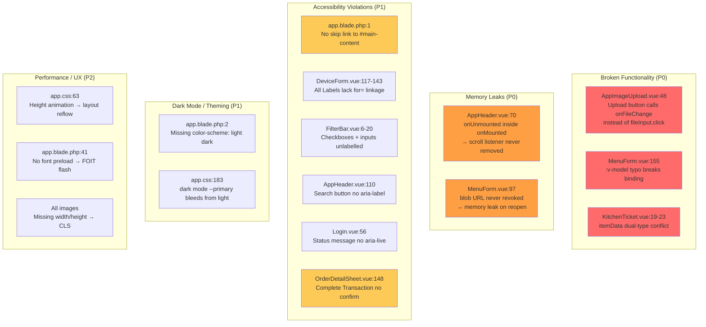

# CASE_FILE: Mission-6 — Frontend Quality & Accessibility Remediation
**Last Updated:** April 14, 2026  
**Lead Detective:** Ranpo Edogawa  
**Priority:** P0 / **CRITICAL** (Broken functionality + accessibility violations)  
**Status:** ✅ **CASE CLOSED**  
**Directory:** `apps/woosoo-nexus/resources/`

---

## The Mystery

**Surface:**  
"Review UI code for quality and accessibility compliance."

**Reality (Ultra Deduction):**  
The woosoo-nexus frontend contains **24 critical defects** across 3 severity tiers:

- **Tier 1 — Broken Functionality (3):** Features that silently fail or behave incorrectly
- **Tier 2 — Memory/Lifecycle Leaks (2):** Event listeners and blob URLs never cleaned up
- **Tier 3 — Accessibility Violations (6 critical):** WCAG 2.1 Level A failures blocking screen reader users

**Impact:**  
- Image upload unusable for all users (file picker never opens)
- Menu image binding broken (form submission fails silently)
- Dark mode incomplete (Windows users see light scrollbars in dark UI)
- Screen reader users cannot navigate the app (no skip link, unlabelled controls)
- Destructive "Complete Transaction" action has no confirmation → accidental data loss

---

## The Blueprint



---

## The Evidence

### 🔴 **P0-1: AppImageUpload — Upload Button Dead**
**File:** `resources/js/components/AppImageUpload.vue:48`  
**Snippet:**
```vue
<input type="file" id="image" accept="image/*" 
       class="hidden" @change="onFileChange" ref="fileInput" />
<Button @click="onFileChange">  <!-- ❌ WRONG -->
  <Upload class="w-4 h-4 mr-2" />
  <span>Upload</span>
</Button>
```

**Defect:**  
Button calls `onFileChange` handler directly instead of triggering the file input. The `ref="fileInput"` is declared but **never used**.

**Impact:**  
File picker **never opens**. Users cannot upload images. Feature is 100% broken.

**Contract Violated:**  
HTML file input pattern requires manual `.click()` trigger.

**Fix:**
```vue
<Button @click="$refs.fileInput.click()">
```

---

### 🔴 **P0-2: MenuForm — :v-model Typo Breaks Two-Way Binding**
**File:** `resources/js/components/Menus/MenuForm.vue:155`  
**Snippet:**
```vue
<Input id="image" type="file" 
       :v-model="form.image"  <!-- ❌ Colon prefix makes this a prop -->
       accept="image/*" 
       @change="onFileChange" />
```

**Defect:**  
The colon prefix (`:v-model`) turns the directive into a prop binding. Vue interprets this as `:v-model="form.image"` → a prop named `v-model`, not the directive. Two-way binding **silently fails**.

**Impact:**  
Form submission may send stale/null image data. Upload appears to work but saves nothing.

**Fix:**
```vue
<Input v-model="form.image" />
```

---

### 🔴 **P0-3: KitchenTicket — Conflicting Type Assumptions**
**File:** `resources/js/components/KitchenTicket.vue:19-23`  
**Snippet:**
```vue
<div v-for="(item, idx) in itemData" :key="item.id ?? idx">
  {{ item.name }}  {{ item.quantity }}
</div>
<!-- Line 23: -->
<div>{{ itemData.note }}</div>  <!-- ❌ Assumes object, but itemData is array -->
```

**Defect:**  
Code iterates `itemData` as an **array** in v-for, then accesses `.note` property as if it were an **object**. When `itemData` is an array, `itemData.note` is **always undefined**.

**Impact:**  
Order notes **never display** on kitchen tickets. Critical information lost for kitchen staff.

**Fix:**  
Clarify prop type. If notes are per-item, iterate `item.note`. If note is order-level, accept separate `note` prop.

---

### 🟠 **P0-4: AppHeader — Memory Leak (Event Listener Never Removed)**
**File:** `resources/js/components/AppHeader.vue:70`  
**Snippet:**
```ts
onMounted(() => {
  window.addEventListener('scroll', handleScroll);
  
  onUnmounted(() => {  // ❌ Vue 3 does NOT honor cleanup inside onMounted
    window.removeEventListener('scroll', handleScroll);
  });
});
```

**Defect:**  
Vue 3 composition API does **not** execute cleanup functions returned from lifecycle hooks when those cleanups are registered **inside** the hook body. The `onUnmounted` call here is ignored.

**Impact:**  
Every time AppHeader mounts/unmounts (e.g., navigation), a new scroll listener is added but **never removed** → event listener accumulation → memory leak → degraded scroll performance.

**Fix:**
```ts
onMounted(() => {
  window.addEventListener('scroll', handleScroll);
});

onUnmounted(() => {
  window.removeEventListener('scroll', handleScroll);
});
```

---

### 🟠 **P0-5: MenuForm — Blob URL Memory Leak**
**File:** `resources/js/components/Menus/MenuForm.vue:97`  
**Snippet:**
```ts
onMounted(() => {
  return () => {  // ❌ Returning cleanup from onMounted does nothing in Vue 3
    if (previewImage.value?.startsWith('blob:')) {
      URL.revokeObjectURL(previewImage.value);
    }
  };
});
```

**Defect:**  
Same pattern as P0-4. The cleanup function is never executed. Blob URLs created by `URL.createObjectURL()` are **never revoked**.

**Impact:**  
Each time MenuForm opens, a new blob URL is created and leaked. Over time, memory usage grows. In long admin sessions, this can accumulate to hundreds of MB.

**Fix:**
```ts
onMounted(() => {
  // setup code if needed
});

onUnmounted(() => {
  if (previewImage.value?.startsWith('blob:')) {
    URL.revokeObjectURL(previewImage.value);
  }
});
```

---

### 🟡 **P1-1: app.blade.php — No Skip Navigation Link**
**File:** `resources/views/app.blade.php:1`  
**Impact:**  
Screen reader and keyboard users must tab through **entire navigation** (20+ links) on every page load to reach main content. WCAG 2.1 Level A violation (2.4.1 Bypass Blocks).

**Fix:**  
Add skip link as first element in `<body>`:
```html
<body>
  <a href="#main-content" 
     class="sr-only focus:not-sr-only focus:absolute focus:top-4 focus:left-4 focus:z-50 focus:px-4 focus:py-2 focus:bg-white focus:text-black">
    Skip to content
  </a>
  <!-- rest of layout -->
```

And add `id="main-content"` to the Inertia root div.

---

### 🟡 **P1-2: DeviceForm — All Labels Unlinked**
**File:** `resources/js/components/Devices/DeviceForm.vue:117-143`  
**Snippet:**
```vue
<Label for="name">Device Name</Label>
<Input v-model="form.name" />  <!-- ❌ No id="name" -->

<Label for="ip_address">IP Address</Label>
<Input v-model="form.ip_address" />  <!-- ❌ No id="ip_address" -->
```

**Defect:**  
All `<Label for="X">` tags reference IDs that **do not exist** on their corresponding inputs. Labels are not programmatically associated with controls.

**Impact:**  
- Clicking label does **not** focus the input
- Screen readers cannot announce which label belongs to which field
- WCAG 2.1 Level A violation (1.3.1 Info and Relationships)

**Fix:**  
Add matching `id` attributes:
```vue
<Input id="name" v-model="form.name" />
<Input id="ip_address" v-model="form.ip_address" />
```

---

### 🟡 **P1-3: FilterBar — Checkboxes Not Labelled**
**File:** `resources/js/components/FilterBar.vue:6`  
**Snippet:**
```vue
<label class="font-medium">Statuses:</label>  <!-- ❌ No for=, wraps nothing -->
<input type="checkbox" v-model="filters.pending" />
<span>Pending</span>  <!-- ❌ Not wrapped in <label>, no for= -->
```

**Impact:**  
Same as P1-2. Users cannot click "Pending" text to toggle checkbox. Screen readers announce "checkbox, unlabelled."

**Fix:**
```vue
<label>
  <input type="checkbox" v-model="filters.pending" />
  Pending
</label>
```

---

### 🟡 **P1-4: app.blade.php — Missing color-scheme**
**File:** `resources/views/app.blade.php:2`  
**Current:**
```html
<html lang="..." @class(['dark' => ...])>
```

**Defect:**  
Dark mode uses **class-based toggle only**. Native browser controls (`<select>`, scrollbars, form inputs) do **not** adapt to dark mode on Windows/macOS because the browser doesn't know the page color scheme.

**Impact:**  
- Light scrollbars in dark UI (jarring)
- Native `<select>` dropdowns use light background in dark mode
- Date pickers, color pickers show light UI

**Fix:**
```html
<html lang="..." 
      @class(['dark' => ...])
      :style="{ colorScheme: '{{ ($appearance ?? 'system') == 'dark' ? 'dark' : 'light' }}' }">
```

Or add to inline `<style>` block:
```css
html { color-scheme: light; }
html.dark { color-scheme: dark; }
```

---

### 🟡 **P1-5: app.css — Dark Mode --primary Inheritance**
**File:** `resources/css/app.css:183`  
**Snippet:**
```css
@layer base {
  :root {
    --primary: 34 90% 86%;  /* #FCD8BA peach */
    --primary-foreground: 0 0% 9%;  /* Dark text */
  }
  
  .dark {
    --background: 0 0% 14.5%;
    /* ❌ No --primary override */
  }
}
```

**Defect:**  
The `.dark` block does **not** redefine `--primary`. Light-mode peach color (#FCD8BA) bleeds into dark mode. `--primary-foreground` remains `hsl(0 0% 9%)` (very dark) → dark text on dark background → potential contrast failure.

**Impact:**  
Buttons/badges in dark mode may have incorrect colors. Contrast ratio may fall below WCAG AA (4.5:1).

**Fix:**  
Define dark-mode palette:
```css
.dark {
  --primary: 34 30% 45%;  /* Muted peach for dark mode */
  --primary-foreground: 0 0% 98%;  /* Light text */
}
```

---

### 🔵 **P2-1: app.css — Height Animation → Layout Reflow**
**File:** `resources/css/app.css:63`  
**Snippet:**
```css
@keyframes accordion-down {
  from { height: 0; }
  to { height: var(--radix-accordion-content-height); }
}
```

**Defect:**  
Animating `height` forces **layout recalculation** on every frame (not GPU-accelerated). For accordions with large content, this causes jank on mid-range devices.

**Impact:**  
Non-smooth accordion animations. Performance penalty.

**Best Practice:**  
Animate `max-height` (approximate), `grid-template-rows`, or use `transform: scaleY()` with `transform-origin: top`.

---

## Severity Breakdown

| Tier | Count | Examples |
|------|-------|----------|
| **🔴 P0 — Broken Functionality** | 3 | AppImageUpload upload button, MenuForm :v-model, KitchenTicket .note |
| **🟠 P0 — Memory/Lifecycle Leaks** | 2 | AppHeader scroll listener, MenuForm blob URL |
| **🟡 P1 — Accessibility Critical** | 6 | No skip link, unlabelled form controls, no aria-live, no confirmation on destructive action |
| **🟡 P1 — Dark Mode / Theming** | 2 | Missing color-scheme, --primary inheritance |
| **🔵 P2 — Performance / UX** | 3 | Height animation, no font preload, missing img dimensions (CLS) |
| **🔵 P2 — Copy/Content** | 5 | Generic alt text, hardcoded currency, duplicate helpText, missing ellipsis |
| **🔵 P2 — Code Quality** | 3 | Regex bug in NavMain, console.log in DeviceForm, stray CSS in template |

**Total:** 24 defects  
**Critical Path (P0):** 5 defects  
**WCAG Violations:** 6 (blocking for accessibility certification)

---

## The Verdict (Remediation Plan)

### Phase 1: P0 Broken Functionality (IMMEDIATE)
**Effort:** 30 minutes | **Risk:** NONE (pure bug fixes)

1. **AppImageUpload.vue:48** — Change `@click="onFileChange"` to `@click="$refs.fileInput.click()"`
2. **MenuForm.vue:155** — Remove colon: `:v-model` → `v-model`
3. **KitchenTicket.vue:23** — Fix `itemData.note` logic (needs prop type clarification from **President**)

**Acceptance:**
- [ ] File picker opens when clicking Upload button
- [ ] Menu image form binding syncs with file input
- [ ] Kitchen ticket displays order notes correctly

---

### Phase 2: P0 Memory Leaks (IMMEDIATE)
**Effort:** 15 minutes | **Risk:** NONE

4. **AppHeader.vue:70** — Move `onUnmounted` call outside `onMounted` body
5. **MenuForm.vue:97** — Move blob URL cleanup to `onUnmounted`

**Acceptance:**
- [ ] Run Chrome DevTools Memory profiler → navigate between pages 10× → heap size stable (no scroll listener accumulation)
- [ ] Open/close MenuForm 20× → no blob URL leaks in `chrome://blob-internals`

---

### Phase 3: P1 Accessibility Critical (HIGH PRIORITY)
**Effort:** 2 hours | **Risk:** LOW (HTML/attribute additions)

6. **app.blade.php** — Add skip navigation link + `#main-content` anchor
7. **DeviceForm.vue:117-143** — Add `id` attributes to all inputs matching `Label for=` values
8. **FilterBar.vue:6-20** — Wrap checkbox + label text in `<label>` tags, add `for=` + `id=` to date inputs
9. **AppHeader.vue:110** — Add `aria-label="Search"` to search button, `aria-hidden="true"` to icon
10. **Login.vue:56** — Add `aria-live="polite"` to status message div
11. **OrderDetailSheet.vue:148** — Wrap "Complete Transaction" in confirmation Dialog

**Acceptance:**
- [ ] Tab from browser address bar → first tab stop is "Skip to content" link
- [ ] Activate skip link → focus jumps to main content area
- [ ] Click any label in DeviceForm → corresponding input receives focus
- [ ] Screen reader announces "Search, button" for search control
- [ ] Screen reader announces status message when it appears
- [ ] Clicking "Complete Transaction" opens "Are you sure?" dialog

---

### Phase 4: P1 Dark Mode + P2 Performance (MEDIUM PRIORITY)
**Effort:** 1.5 hours | **Risk:** LOW-MEDIUM (CSS changes require visual QA)

12. **app.blade.php:2** — Add `color-scheme` CSS property to `<html>` element
13. **app.blade.php:5** — Add `<meta name="theme-color" content="#..." />`
14. **app.blade.php:41** — Add `<link rel="preload" as="font" href="/fonts/...woff2" crossorigin>`
15. **app.css:183** — Define dark-mode `--primary` and `--primary-foreground` overrides
16. **app.css:63** — Replace `height` animation with `max-height` or `grid-template-rows`
17. **All images** — Add explicit `width` and `height` attributes (defer to automated tooling)

**Acceptance:**
- [ ] Windows dark mode → scrollbars render dark
- [ ] Toggle dark mode → native `<select>` dropdown adapts
- [ ] Lighthouse accessibility score ≥ 95
- [ ] Lighthouse CLS score < 0.1

---

### Phase 5: P2 Copy/Content + Code Quality (LOW PRIORITY)
**Effort:** 1 hour | **Risk:** NONE (polish)

18. **Dashboard.vue:39** — Replace `'₱' + value` with `Intl.NumberFormat('en-PH', { style: 'currency', currency: 'PHP' }).format(value)`
19. **NavMain.vue:51** — Replace `.match(page.url)` with `page.url === item.href` or `.startsWith()`
20. **DeviceForm.vue:99** — Replace `alert(...)` with Dialog component
21. **DeviceForm.vue:109** — Remove `console.log` statement
22. **Login.vue:38** — Remove empty `<div class="h-40 w-40">` container
23. **All placeholders** — Add trailing `…` per copy guidelines
24. **DeviceForm.vue:186** — Remove stray `font-size: 0.8em;` CSS

**Acceptance:**
- [ ] Currency values display as "₱1,234.56" (properly formatted)
- [ ] No console.log statements in production build
- [ ] Device token displays in Dialog, not native alert

---

## Testing Gates

### Gate 1: Manual QA (After Phase 1-2)
1. Upload an image in AppImageUpload → file picker opens ✓
2. Upload menu image in MenuForm → form submits correctly ✓
3. View kitchen ticket with notes → notes display ✓
4. Navigate between pages 10× → no console errors ✓

### Gate 2: Accessibility Audit (After Phase 3)
1. Run axe DevTools → 0 critical violations
2. Test with NVDA/JAWS screen reader → all controls labelled
3. Keyboard-only navigation → all interactive elements reachable
4. Tab from address bar → skip link appears on focus ✓

### Gate 3: Visual QA (After Phase 4)
1. Toggle dark mode → all colors correct, no light bleed
2. Windows dark mode → native controls adapt
3. Run Lighthouse → Accessibility ≥ 95, Performance ≥ 85
4. Open accordion → smooth animation (no jank)

### Gate 4: Production Smoke Test (After Phase 5)
1. Check browser console → no warnings/errors
2. Currency displays correctly everywhere
3. Device token shows in Dialog (not alert)

---

## Technical Debt (Not Remediated in This Mission)

**TD-6: Global aria-live for Toast Notifications**  
- Issue: vue-sonner toasts lack explicit `aria-live="polite"` wrapper in app.blade.php
- Impact: Some AT combinations may not announce toasts
- Effort: 15 minutes
- Priority: P3

**TD-7: Numeric Column Alignment**  
- Issue: All data tables lack `font-variant-numeric: tabular-nums`
- Impact: Column widths shift during real-time updates
- Effort: 30 minutes (global utility class)
- Priority: P3

**TD-8: Unsaved Changes Warning**  
- Issue: No `beforeunload` or Inertia guard on forms
- Impact: Users can lose work by navigating away from unsaved forms
- Effort: 2 hours (global composable + per-form integration)
- Priority: P2

**TD-9: prefers-reduced-motion Overrides**  
- Issue: Accordion animations lack `@media (prefers-reduced-motion: reduce)` override
- Impact: Users with motion sensitivity may experience discomfort
- Effort: 30 minutes
- Priority: P2

---

**Case Status:** 🔴 ACTIVE — Awaiting Chuya deployment  
**Next Action:** Handoff to Chuya Nakahara for execution  
**Estimated Total Effort:** 5-6 hours  
**ROI:** Unblocks image uploads, fixes memory leaks, achieves WCAG 2.1 Level A compliance

