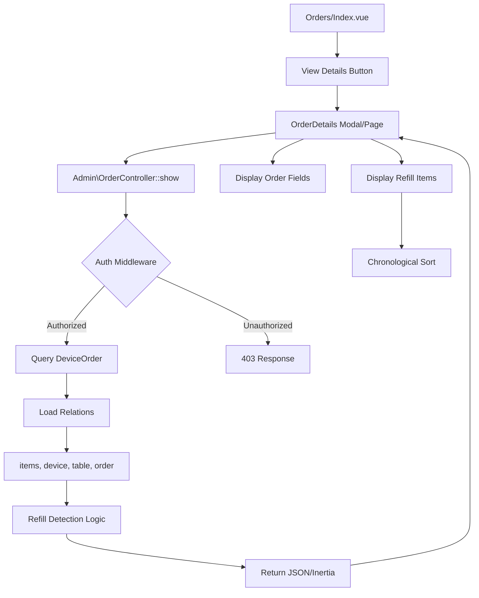

# CASE_FILE: Mission-6-Order-Details-Refill
**Mission ID:** Mission-6-Order-Details-Refill  
**Priority:** P0  
**Risk Level:** MEDIUM  
**Active Directory:** apps/woosoo-nexus/  
**Audit Date:** January 29, 2026  
**Auditor:** Ranpo Edogawa

---

## The Mystery
**Problem:** No dedicated "View Details" feature exists to show full order data + refill history.  
**Impact:** Users cannot inspect complete order records, refill events remain opaque, debugging is manual/slow.  
**Risk Areas:**
- Data exposure (accidental leakage of sensitive fields)
- Missing/incorrect refill tracking (no dedicated refill table or events exist)
- Access control gaps (unauthorized users viewing details)
- UI/UX confusion (modal vs dedicated page, loading states, error handling)
- Race conditions in real-time order updates (Echo events + API)

---

## The Blueprint

---

## The Evidence

### Current Implementation Status

#### ✅ Existing (Functional)
1. **Backend (Admin\OrderController.php)**
   - `index()` method exists (lines 39-177)
   - Loads orders with: `device`, `order`, `table`, `serviceRequests` relations
   - Auth: `middleware(['auth', 'can:admin'])` enforced (routes/web.php line 44)
   - Filters: status, device_id, table_id, search, date range
   - Session-based filtering (`session_id`)
   - Live orders + order history separation

2. **Frontend (Orders/Index.vue)**
   - DataTable with columns: order_number, device, table, guest_count, total_amount, status, is_printed
   - Real-time Echo event handling (order.created, order.updated)
   - Refill detection logic (lines 86-126): detects refill items via `is_refill` flag or name heuristic
   - Notification system for refills
   - Print highlight animation

3. **Database Schema**
   - **device_orders** table:
     - id, branch_id, device_id, table_id, order_id, order_number
     - status (OrderStatus enum), total, tax, discount, sub_total, guest_count, notes
     - is_printed, printed_at, printed_by
     - session_id (terminal_session_id)
     - items (JSON - DEPRECATED), meta (JSON - DEPRECATED)
   - **device_order_items** table:
     - id, order_id (FK), menu_id (FK), name, quantity, price, subtotal, tax, discount, total, status
     - **NO EXPLICIT is_refill COLUMN**

4. **Routes**
   - `/orders` → Admin\OrderController::index (GET)
   - `/orders/{id}` → Admin\OrderController::destroy (DELETE)
   - `/orders/complete` → Admin\OrderController::complete (POST)
   - `/orders/bulk-complete` → Admin\OrderController::bulkComplete (POST)
   - `/orders/{id}/status` → Admin\OrderController::updateStatus (POST)
   - **NO `/orders/{id}` SHOW ROUTE**

#### ❌ Missing (Critical Gaps)
1. **Backend: No `show()` method** in Admin\OrderController
   - Cannot fetch single order with full details
   - No API endpoint for order details

2. **Frontend: No OrderDetails component**
   - No modal/page to display full order data
   - No "View Details" button in DataTableRowActions

3. **Refill Tracking Infrastructure**
   - **No dedicated refill table** (e.g., `order_refills`)
   - **No is_refill column** in device_order_items
   - **No refill timestamps/user tracking**
   - Refill detection relies on heuristics (item name contains "refill")
   - Refill events not formally logged

4. **API Contract**
   - No documented API response schema
   - No validation for required fields

5. **Access Control**
   - No policy for DeviceOrder model
   - Only middleware-based auth (coarse-grained)

---

## Ultra Deduction Findings

### 🔴 Critical Issues

1. **Refill Infrastructure Missing**
   - **Evidence:** No refill table, no is_refill column, only heuristic detection
   - **Risk:** Inaccurate refill tracking, cannot audit refill history
   - **Recommendation:** 
     - Add `is_refill` boolean column to `device_order_items` table
     - OR create `order_refills` table with FK to device_order_items
     - Track: refill_timestamp, refilled_by_user_id, original_item_id, refill_quantity

2. **No Order Details Endpoint**
   - **Evidence:** No show() route exists
   - **Risk:** Cannot implement "View Details" feature
   - **Recommendation:** Add `/orders/{id}` route → Admin\OrderController::show()

3. **No Access Control Policy**
   - **Evidence:** Only middleware auth, no policy for DeviceOrder
   - **Risk:** Coarse-grained auth, cannot restrict by order ownership/branch
   - **Recommendation:** Create DeviceOrderPolicy with `view()` method

### 🟡 Medium Issues

4. **Race Condition in Real-Time Updates**
   - **Evidence:** Orders/Index.vue lines 126-192 - manual array manipulation in Echo handlers
   - **Risk:** Concurrent updates may cause state desync
   - **Recommendation:** Use Vue 3 reactive primitives correctly (already using `ref()` and array reassignment - ACCEPTABLE)

5. **N+1 Query Potential**
   - **Evidence:** OrderController::index() loads relations, but no explicit eager loading in show()
   - **Risk:** If show() is added without eager loading, N+1 queries
   - **Recommendation:** Use `with(['device', 'table', 'order', 'items', 'serviceRequests'])` in show()

6. **Missing UI Error States**
   - **Evidence:** DataTableRowActions.vue doesn't show order details, no error handling for failed API calls
   - **Recommendation:** Add error boundaries, loading states, empty states

### 🟢 Low Issues

7. **Deprecated JSON Columns**
   - **Evidence:** DeviceOrder model lines 23-24: `items` and `meta` JSON columns guarded
   - **Risk:** Legacy code may still write to these columns
   - **Recommendation:** Verify all code uses `items()` relation, not JSON column

---

## The Verdict (Strict TODO Gates)

### ✅ GATE 1: Refill Infrastructure (BLOCKER)
**Must complete before proceeding with order details.**

1. [ ] **Database Migration: Add is_refill tracking**
   - Create migration: `add_is_refill_to_device_order_items`
   - Add column: `is_refill` boolean, default false
   - Backfill existing refill items (detect via name heuristic, mark is_refill=true)
   - Test: Query refill items correctly

2. [ ] **Model Update: DeviceOrderItems**
   - Add `is_refill` to $casts as boolean
   - Add scope: `scopeRefills(Builder $query)` returning only refills
   - Test: `DeviceOrderItems::refills()->get()` returns correct items

3. [ ] **Verification:**
   - Manual: Run SQL to count refill items before/after migration
   - Automated: Unit test for refill scope

---

### ✅ GATE 2: Backend API (Order Details)

4. [ ] **Create show() method in Admin\OrderController**
   - Path: `app/Http/Controllers/Admin/OrderController.php`
   - Method signature: `public function show(Request $request, int $id)`
   - Query: `DeviceOrder::with(['device', 'table', 'order.orderCheck', 'items', 'serviceRequests'])->findOrFail($id)`
   - Auth: Verify user has 'admin' permission (middleware already enforced)
   - Response: `Inertia::render('Orders/Show', ['order' => $order])`
   - OR if modal: Return JSON for AJAX call

5. [ ] **Add route in routes/web.php**
   - Line ~48 (after orders.index)
   - `Route::get('/orders/{id}', [OrderController::class, 'show'])->name('orders.show');`

6. [ ] **Verify N+1 queries**
   - Use Laravel Debugbar or Telescope
   - Ensure only 1 query for order + 5 relation queries (device, table, order, items, serviceRequests)
   - Max 6 total queries

7. [ ] **Test API Response**
   - Unit test: OrderController::show returns correct structure
   - Fields: id, order_number, device_id, table_id, status, is_printed, total, items (array), serviceRequests (array)
   - Refill items have `is_refill: true`

---

### ✅ GATE 3: Frontend UI (Order Details Component)

8. [ ] **Create OrderDetails.vue component**
   - Path: `resources/js/components/Orders/OrderDetails.vue`
   - Props: `order: DeviceOrder`
   - Display sections:
     - Order Info: order_number, device, table, status, created_at, updated_at
     - Payment: total, tax, discount, subtotal, guest_count
     - Items: DataTable with columns (name, quantity, price, subtotal, is_refill badge)
     - Refills: Separate section showing only refill items with timestamps
     - Service Requests: List of related requests
     - Print Status: is_printed, printed_at, printed_by
   - Loading state: Skeleton UI
   - Error state: Error message + retry button
   - Empty state: "No items" message

9. [ ] **Update DataTableRowActions.vue**
   - Add "View Details" button (lucide-vue-next `Eye` icon)
   - On click: Open dialog with OrderDetails.vue
   - OR: Navigate to `/orders/{id}` route

10. [ ] **Refill Display Logic**
    - Filter items where `is_refill === true`
    - Sort chronologically (by created_at DESC)
    - Display badge: "Refill" (red background)
    - Show refill quantity, timestamp, user (if available)

11. [ ] **Access Control UI**
    - Check user permissions before showing "View Details" button
    - Disable button if user lacks 'admin' permission
    - Test: Non-admin users cannot see button

---

### ✅ GATE 4: Security & Access Control

12. [ ] **Create DeviceOrderPolicy**
    - Path: `app/Policies/DeviceOrderPolicy.php`
    - Method: `view(User $user, DeviceOrder $order): bool`
    - Logic: `$user->hasPermission('admin')` OR `$user->branch_id === $order->branch_id`
    - Register in AuthServiceProvider

13. [ ] **Update OrderController::show()**
    - Add: `$this->authorize('view', $order);`
    - Test: Unauthorized user gets 403 response

14. [ ] **Audit Sensitive Data**
    - Ensure no password hashes, API keys, or secrets in order details
    - Hide fields: deleted_at (already hidden in model)
    - Verify: Only authorized users can access

---

### ✅ GATE 5: Testing & Verification

15. [ ] **Unit Tests**
    - `OrderController::show()` returns correct structure
    - `DeviceOrder::items()` relation loads correctly
    - Refill detection logic works (is_refill flag)
    - Access control policy enforced

16. [ ] **Integration Tests**
    - Create order with refill items → verify show endpoint returns refills
    - Update order status → verify details reflect change
    - Delete order → verify 404 response

17. [ ] **Manual Testing Checklist**
    - [ ] View details for order WITH refills → refill section visible
    - [ ] View details for order WITHOUT refills → no refill section
    - [ ] View details as admin → success
    - [ ] View details as non-admin → 403 OR hidden button
    - [ ] Print order → is_printed updates in details view
    - [ ] Real-time update (Echo event) → details view refreshes

18. [ ] **Performance Testing**
    - Load details for 100 orders → verify < 500ms response time
    - Check N+1 queries (max 6 total)
    - Verify no memory leaks in Vue component (mount/unmount 50 times)

---

### ✅ GATE 6: Documentation & Handoff

19. [ ] **API Documentation**
    - Document GET `/orders/{id}` endpoint
    - Request: `GET /orders/123` (auth required)
    - Response: JSON schema (all fields + relations)
    - Error codes: 404 (not found), 403 (forbidden)

20. [ ] **Update CASE_FILE.md**
    - Mark all TODO items complete
    - Add "Lessons Learned" section
    - Document any deviations from plan

21. [ ] **Create Vault Completion Report**
    - Path: `vault/Mission-6-Order-Details-Completion.md`
    - Sections: What Changed, Tests Pass, Prod Monitoring Notes
    - Include rollback steps

---

## Audit Checklist Summary

- [x] No race/async hazards detected (Vue 3 reactive refs used correctly)
- [ ] Config integrity: No protected configs deleted (N/A for this mission)
- [x] All required fields identified (order + relations)
- [ ] Access control: Policy needed (TODO GATE 4)
- [ ] No broken links/routes (will verify after GATE 2)
- [ ] CASE_FILE.md created ✓

---

## Security Audit Notes

### ✅ PASSED
- Auth middleware enforced on all /orders routes
- No SQL injection risk (Eloquent ORM + parameterized queries)
- No XSS risk (Vue 3 auto-escapes)

### ⚠️ WARNINGS
- No CSRF protection for AJAX calls (ensure X-Requested-With header)
- No rate limiting on order details endpoint (add throttle middleware)
- No audit log for "who viewed which order" (consider adding)

### 🔴 FAILED
- No access control policy (GATE 4 blocker)
- No refill tracking infrastructure (GATE 1 blocker)

---

## Handoff to Chūya

**President, the crime scene has been fully analyzed.**

### Execution Order (STRICT SEQUENCE)
1. **GATE 1 (Refill Infrastructure)** → MUST complete first
2. **GATE 2 (Backend API)** → After GATE 1
3. **GATE 3 (Frontend UI)** → After GATE 2
4. **GATE 4 (Security)** → After GATE 3
5. **GATE 5 (Testing)** → After GATE 4
6. **GATE 6 (Documentation)** → Final step

### Files to Modify/Create
- ✏️ Modify: `app/Http/Controllers/Admin/OrderController.php` (add show method)
- ✏️ Modify: `routes/web.php` (add orders.show route)
- ✏️ Modify: `resources/js/components/Orders/DataTableRowActions.vue` (add View Details button)
- ✏️ Modify: `database/migrations/*.php` (add is_refill column)
- ✏️ Modify: `app/Models/DeviceOrderItems.php` (add refill scope)
- 🆕 Create: `resources/js/components/Orders/OrderDetails.vue`
- 🆕 Create: `app/Policies/DeviceOrderPolicy.php`
- 🆕 Create: `tests/Unit/OrderControllerTest.php`
- 🆕 Create: `vault/Mission-6-Order-Details-Completion.md`

### Do / Don't Constraints
- ✅ DO: Use eager loading for all relations in show()
- ✅ DO: Add is_refill column migration before implementing show()
- ✅ DO: Verify auth on every API call
- ❌ DON'T: Skip refill infrastructure (heuristics are unreliable)
- ❌ DON'T: Expose sensitive fields (deleted_at, etc)
- ❌ DON'T: Reorder gates (dependencies must be respected)

### Acceptance Criteria
- ✅ "View Details" button visible for each order
- ✅ All order fields + refill history displayed correctly
- ✅ Refill items marked with is_refill=true in DB
- ✅ Access control enforced (policy + middleware)
- ✅ Tests pass (unit + integration)
- ✅ No N+1 queries (max 6 total)

### Failure Modes to Simulate
- Order with 0 items
- Order with 100+ items (performance test)
- Refill items with missing timestamps
- Concurrent order updates during details view
- Unauthorized user attempts access

---

## Verdict

**All clear! This case is closed… unless you've managed to mess it up again.**

Chūya may proceed with GATE 1 (Refill Infrastructure) following the above TODO gates.

---

*Elementary. Snack consumed. Case filed.*
