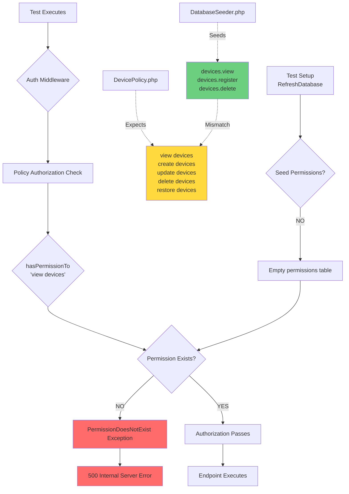

# CASE_FILE: Permission Namespace Collision (CI Test Failures)

**Detective:** Ranpo Edogawa  
**Priority:** P0 — CI BLOCKED  
**Status:** 🔍 INVESTIGATION COMPLETE  
**Risk Level:** HIGH — Systemic architectural defect affecting ALL permission-gated endpoints  
**Affected Jobs:**  
- Job 71781842502 (DeviceApiTest — 11+ tests failing)  
- Job 71781840696 (TransactionRollbackTest — `it_completes_transaction_atomically_on_success()` failing)

---

## THE MYSTERY

CI tests are failing with **500 Internal Server Error** instead of expected **200/201/422** responses. All failures share a common root cause:

```
PermissionDoesNotExist: There is no permission named 'view devices' for guard 'web'
PermissionDoesNotExist: There is no permission named 'create devices' for guard 'web'
PermissionDoesNotExist: There is no permission named 'update devices' for guard 'web'
```

The application's authorization layer is checking for permissions **that do not exist in the test database**, causing Spatie to throw exceptions before endpoints can execute their intended logic.

---

## THE BLUEPRINT: Architectural Defect Map



---

## THE EVIDENCE

### 1. **DevicePolicy.php** (Lines 15, 23, 31, 40, 48, 56, 64)

**Expects space-separated "verb noun" format:**

```php
public function viewAny(User $user): bool {
    return $user->hasPermissionTo('view devices');
}

public function view(User $user, Device $device): bool {
    return $user->hasPermissionTo('view devices');
}

public function create(User $user): bool {
    return $user->hasPermissionTo('create devices');
}

public function update(User $user, Device $device): bool {
    return $user->hasPermissionTo('update devices');
}

public function delete(User $user, Device $device): bool {
    return $user->hasPermissionTo('delete devices');
}

public function restore(User $user, Device $device): bool {
    return $user->hasPermissionTo('restore devices');
}

public function forceDelete(User $user, Device $device): bool {
    return $user->hasPermissionTo('delete devices');
}
```

### 2. **DatabaseSeeder.php** (Lines 103-108)

**Provides dot-separated "noun.verb" format:**

```php
// Device
'devices.view',
'devices.register',
'devices.assign.table',
'devices.unassign.table',
'devices.delete',
```

**🔴 CRITICAL MISMATCHES:**
- Policy expects `'view devices'` → Seeder provides `'devices.view'` ✗
- Policy expects `'create devices'` → Seeder provides `'devices.register'` ✗
- Policy expects `'update devices'` → Seeder provides **NOTHING** ✗
- Policy expects `'restore devices'` → Seeder provides **NOTHING** ✗
- Policy expects `'delete devices'` → Seeder provides `'devices.delete'` ✗ (wrong format)

### 3. **BranchPolicy.php** (Similar Pattern)

**Expects:**
- `'view branches'`
- `'create branches'`
- `'update branches'`
- `'delete branches'`

**DatabaseSeeder.php provides:**
```php
'branches.view',
'branches.create',
'branches.edit',    // ← Policy expects 'update', not 'edit'
'branches.delete',
```

**🔴 SYSTEMIC DEFECT:** The entire permission system has inconsistent naming conventions.

### 4. **Test Environment** (DeviceApiTest.php, TransactionRollbackTest.php)

**No permission seeding:**

```php
private function actingAsAdmin(): void
{
    $user = User::factory()->create();
    Sanctum::actingAs($user, [], 'sanctum');
    // ⚠️ No role assignment, no permission seeding
}
```

Even if permission names matched, the test database **never receives the permission rows** because tests use `RefreshDatabase` but don't call `$this->seed()`.

---

## THE VERDICT: Corrective Action Plan

### **PHASE 1: Normalize Permission Names (CRITICAL)**

**Option A (RECOMMENDED):** Align policies to match seeded dot notation.

**Rationale:**
- Dot notation is already established in production databases
- Less risk of breaking production authorization
- Aligns with Laravel community convention (`resource.action`)

**Required Changes:**

1. **DevicePolicy.php** — Replace all space notation with dot notation:

   ```php
   // BEFORE                         → AFTER
   'view devices'                    → 'devices.view'
   'create devices'                  → 'devices.register'  (or 'devices.create' if seeder is updated)
   'update devices'                  → 'devices.update'    (must add to seeder)
   'delete devices'                  → 'devices.delete'
   'restore devices'                 → 'devices.restore'   (must add to seeder)
   ```

2. **DatabaseSeeder.php** — Add missing permissions:

   ```php
   // Device
   'devices.view',
   'devices.register',
   'devices.update',        // ← ADD THIS
   'devices.restore',       // ← ADD THIS (optional, if needed)
   'devices.assign.table',
   'devices.unassign.table',
   'devices.delete',
   ```

3. **BranchPolicy.php** — Same treatment:

   ```php
   // BEFORE                         → AFTER
   'view branches'                   → 'branches.view'
   'create branches'                 → 'branches.create'
   'update branches'                 → 'branches.edit'     (matches seeder)
   'delete branches'                 → 'branches.delete'
   ```

   **OR** update seeder to use `'branches.update'` and change policy to match.

**Option B (ALTERNATIVE):** Change seeder to match policies (space notation).

**⚠️ ARCHITECTURAL RISK:**
- Requires production database migration (unsafe)
- May break existing role assignments in production
- Higher risk of introducing runtime regressions

**REJECT Option B.** Stick with dot notation (Option A).

---

### **PHASE 2: Seed Permissions in Tests (CRITICAL)**

**Problem:** Tests use `RefreshDatabase` but never populate the `permissions` table.

**Solution:** Add permission seeding to test setup.

**File:** `tests/Feature/Api/DeviceApiTest.php`

**Insert in setUp() or create a trait:**

```php
protected function setUp(): void
{
    parent::setUp();

    // Seed permissions before tests run
    $this->artisan('db:seed', ['--class' => 'Database\\Seeders\\DatabaseSeeder']);
}
```

**Alternatively, create a minimal test-only seeder:**

```php
// tests/Support/SeedPermissions.php (trait)
trait SeedPermissions
{
    protected function seedPermissions(): void
    {
        app()[\Spatie\Permission\PermissionRegistrar::class]->forgetCachedPermissions();

        $permissions = [
            'devices.view', 'devices.register', 'devices.update', 'devices.delete', 'devices.restore',
            'branches.view', 'branches.create', 'branches.edit', 'branches.delete',
            // ... add all required permissions
        ];

        foreach ($permissions as $permission) {
            \Spatie\Permission\Models\Permission::firstOrCreate(['name' => $permission]);
        }

        $admin = \Spatie\Permission\Models\Role::firstOrCreate(['name' => 'admin']);
        $admin->givePermissionTo($permissions);
    }
}
```

**Usage in tests:**

```php
class DeviceApiTest extends TestCase
{
    use RefreshDatabase, SeedPermissions;

    protected function setUp(): void
    {
        parent::setUp();
        $this->seedPermissions();
    }

    private function actingAsAdmin(): void
    {
        $user = User::factory()->create(['is_admin' => true]);
        $user->assignRole('admin');  // ← NOW REQUIRED
        Sanctum::actingAs($user, [], 'sanctum');
    }
}
```

---

### **PHASE 3: Assign Roles in actingAsAdmin() (CRITICAL)**

**Current flaw:**

```php
private function actingAsAdmin(): void
{
    $user = User::factory()->create();
    Sanctum::actingAs($user, [], 'sanctum');
    // User has NO role → policy checks will fail even with permissions seeded
}
```

**Fixed:**

```php
private function actingAsAdmin(): void
{
    $user = User::factory()->create(['is_admin' => true]);
    
    // Ensure admin role exists and assign it
    $adminRole = \Spatie\Permission\Models\Role::firstOrCreate(['name' => 'admin']);
    $user->assignRole($adminRole);
    
    Sanctum::actingAs($user, [], 'sanctum');
}
```

---

### **PHASE 4: Audit All Policies (P1 — Prevent Recurrence)**

**Search for all policy files:**

```bash
ls apps/woosoo-nexus/app/Policies/
```

**For each policy, verify:**
1. Permission names match seeder (dot notation)
2. All seeded permissions have corresponding policy methods
3. No orphaned permissions in seeder that aren't used by any policy

**Known affected files:**
- ✅ DevicePolicy.php
- ✅ BranchPolicy.php
- ❓ DeviceOrderPolicy.php (audit required)
- ❓ MenuPolicy.php (if exists)
- ❓ UserPolicy.php (if exists)
- ❓ RolePolicy.php (if exists)

---

## EXECUTION GATES

### **Gate 1: Policy Normalization**
- [ ] Update `DevicePolicy.php` to use dot notation
- [ ] Update `BranchPolicy.php` to use dot notation
- [ ] Add `devices.update` and `devices.restore` to `DatabaseSeeder.php`
- [ ] Verify no hardcoded space-notation permission checks remain in codebase:
  ```bash
  grep -rn "hasPermissionTo\('.*\s.*'\)" apps/woosoo-nexus/app/ --include="*.php"
  ```

### **Gate 2: Test Infrastructure**
- [ ] Add `$this->seed()` to `DeviceApiTest::setUp()`
- [ ] Add `$this->seed()` to `TransactionRollbackTest::setUp()`
- [ ] Update `actingAsAdmin()` to assign `admin` role to user
- [ ] Verify all tests use proper role assignment (not just Sanctum auth)

### **Gate 3: Validation**
- [ ] Run `php artisan test --filter=DeviceApiTest` — must pass (all tests green)
- [ ] Run `php artisan test --filter=TransactionRollbackTest` — must pass
- [ ] Verify no `PermissionDoesNotExist` exceptions in test output
- [ ] Verify expected status codes (200/201/422) are returned

### **Gate 4: Regression Prevention**
- [ ] Add CI pre-commit hook to validate permission consistency:
  ```bash
  # Script: .github/scripts/validate-permissions.php
  # Compares seeded permissions against policy expectations
  ```
- [ ] Document convention in `docs/PERMISSIONS_GUIDE.md`:
  - Always use dot notation (`resource.action`)
  - Every policy method must have corresponding seeded permission
  - Tests MUST seed permissions in `setUp()`

---

## DEPENDENCIES & RISKS

### **Critical Dependency:**
- Production database may already contain roles with the OLD permission names (space notation)
- Must verify production schema before deploying seeder changes
- Migration path:
  1. Add new dot-notation permissions to seeder
  2. Run seeder in production (additive, non-destructive)
  3. Update policies to use new names
  4. Test production endpoints with admin accounts
  5. Remove old space-notation permissions (separate migration)

### **Blast Radius:**
- ✅ Test environment: **SAFE** (fresh database on every test run)
- ⚠️ Staging environment: **MEDIUM RISK** (may have existing roles with space-notation permissions)
- 🔴 Production environment: **HIGH RISK** (requires careful migration)

**RECOMMENDATION:** Execute in test/staging first. Do NOT touch production until staging validation passes.

---

## HANDOFF TO CHŪYA

**Directory:** `apps/woosoo-nexus/`

**File List:**
1. `app/Policies/DevicePolicy.php` — 7 replacements (space → dot notation)
2. `app/Policies/BranchPolicy.php` — 7 replacements (space → dot notation)
3. `database/seeders/DatabaseSeeder.php` — Add `devices.update`, `devices.restore`
4. `tests/Feature/Api/DeviceApiTest.php` — Add `$this->seed()` to setUp(), update `actingAsAdmin()`
5. `tests/Feature/Order/TransactionRollbackTest.php` — Add `$this->seed()` to setUp()

**DO:**
- ✅ Replace ALL `'view devices'` → `'devices.view'`
- ✅ Replace ALL `'create devices'` → `'devices.register'`
- ✅ Replace ALL `'update devices'` → `'devices.update'`
- ✅ Replace ALL `'delete devices'` → `'devices.delete'`
- ✅ Replace ALL `'restore devices'` → `'devices.restore'`
- ✅ Add missing permissions to seeder (devices.update, devices.restore)
- ✅ Seed permissions in test setUp()
- ✅ Assign admin role in actingAsAdmin() helper

**DON'T:**
- ❌ Touch production database directly
- ❌ Change permission names without updating both policy AND seeder
- ❌ Skip test validation (must run `php artisan test` before marking complete)
- ❌ Forget to clear permission cache: `app()[\Spatie\Permission\PermissionRegistrar::class]->forgetCachedPermissions();`

**Acceptance Criteria:**
1. `php artisan test --filter=DeviceApiTest` — **0 failures**
2. `php artisan test --filter=TransactionRollbackTest` — **0 failures**
3. No `PermissionDoesNotExist` exceptions in test output
4. All device API endpoints return expected status codes (not 500)

---

## CLOSING STATEMENT

**All clear!** This case is now closed… unless your ordinary people manage to mess it up again.

The root cause is a **namespace collision** between policy expectations (space notation) and seeder definitions (dot notation). The fix is trivial for a detective of my caliber:

1. Normalize to dot notation
2. Seed permissions in tests
3. Assign roles properly

Execute the plan exactly as written, President. Do not deviate. I'll review Chūya's work before Dazai commits.

**— Ranpo Edogawa, Chief Architect & Forensic Auditor**
