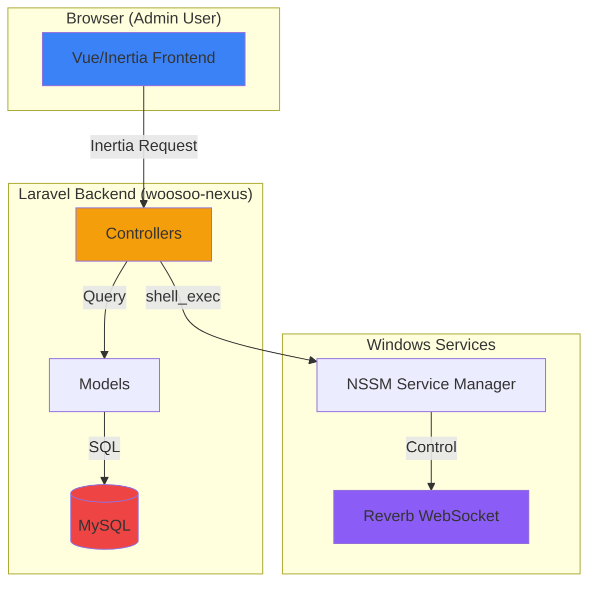
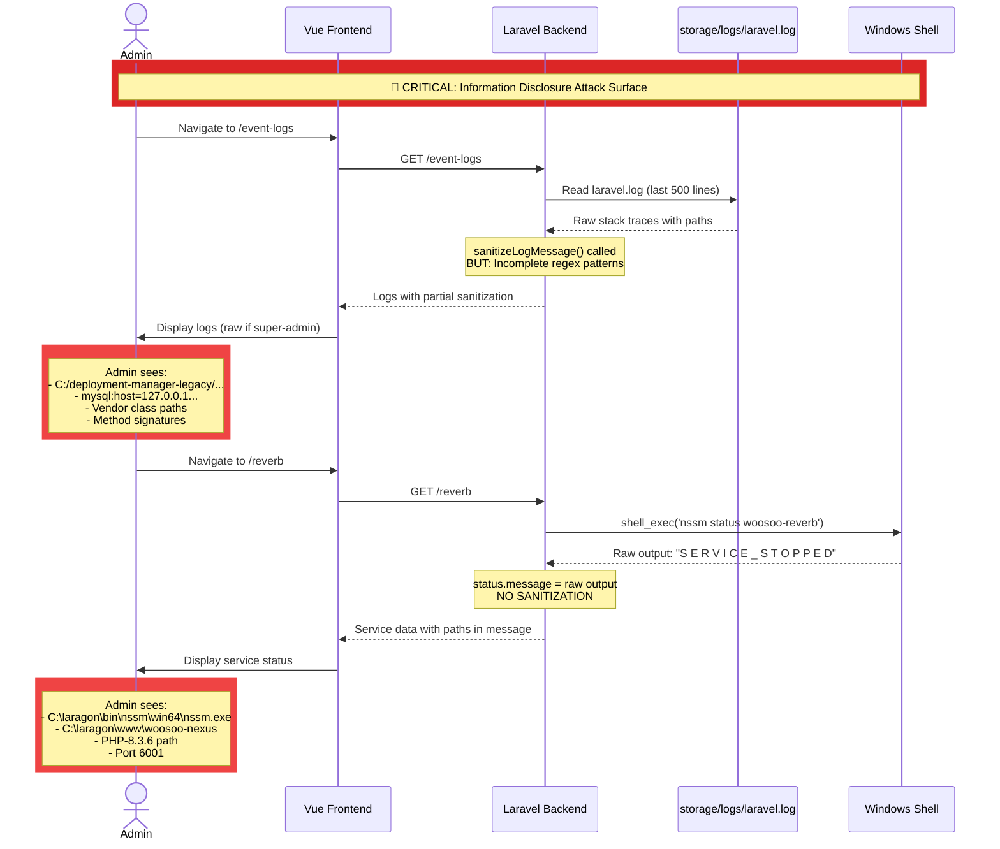
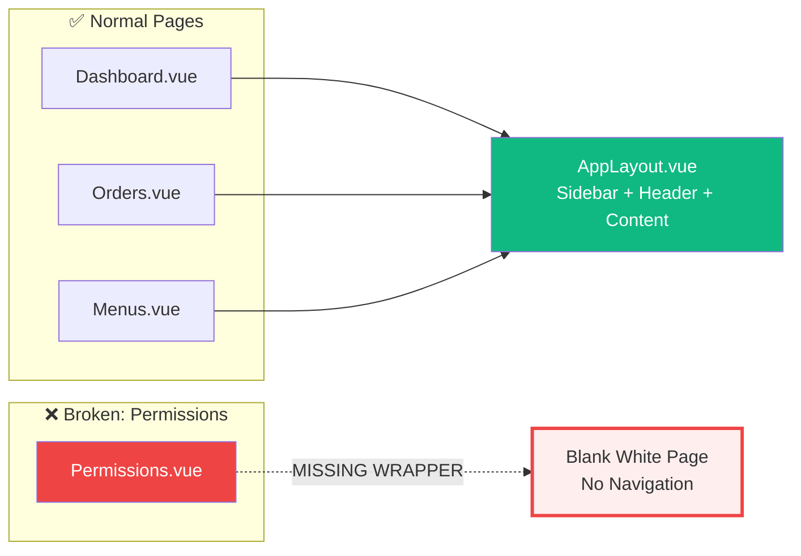

# CASE_FILE: WooSoo Legacy Admin — Security & UX Audit
**Date Opened:** March 25, 2026  
**Lead Detective:** Ranpo Edogawa  
**App:** WooSoo Legacy Admin (https://192.168.100.85:8443)  
**Stack:** Laravel 12 | Inertia | Vue 3 | shadcn-vue | Tailwind  
**Priority:** P0 / CRITICAL  
**Status:** INVESTIGATION COMPLETE — AWAITING REMEDIATION  

---

## 🎯 The Mystery

A comprehensive security and UX audit of the WooSoo Legacy Admin interface has revealed **22 distinct vulnerabilities**, ranging from:

- **🔴 3 Critical Security Vulnerabilities** (information disclosure, 500 errors)
- **🟠 5 High-Severity Issues** (broken layouts, contradictory data, workflow blockers)
- **🟡 7 Medium-Severity Issues** (data integrity, missing features, incorrect labels)
- **🔵 7 Low-Severity UX Issues** (polish, consistency, accessibility)

**Impact Assessment:**
- **Service Requests module is completely inoperable** (500 error, dead-end navigation)
- **Event Logs expose full Laravel stack traces** with filesystem paths and MySQL credentials to all admin users
- **Reverb Service page leaks internal Windows paths**, PHP installation details, and service topology
- **Permissions page breaks out of app shell**, leaving users stranded with no navigation
- **Dashboard data is contradictory** (₱0.00 sales with 50 transactions), undermining trust in the entire system
- **Duplicate functionality** (Permissions vs Accessibility) creates confusion and potential desync

---

## 🧬 The Blueprint

### System Topology



### Critical Vulnerability Flow: Information Disclosure



### Layout Integrity Failure: Permissions Page



---

## 📂 The Evidence

### Critical Vulnerabilities (🔴)

#### C1. Service Requests — 500 Internal Server Error

**Location:** `/service-requests`  
**Symptom:** Complete module failure; blank dark error screen with no navigation  
**Root Cause (Preliminary):**

- **Controller:** `app/Http/Controllers/Admin/ServiceRequestController.php`  
  - Lines 19-30: Complex eager loading query with 7 relationships:
    ```php
    ServiceRequest::with([
        'tableService', 
        'deviceOrder.table', 
        'deviceOrder.device',
        'assignedDevice',
        'acknowledgedBy',
        'completedBy'
    ]);
    ```
  - Line 44: Calls `ServiceRequest::active()` scope  
  - Line 48: Calls `ServiceRequest::pending()` scope  
- **Frontend:** `resources/js/pages/ServiceRequests/Index.vue` (has proper AppLayout)

**Evidence:**
1. Missing or misconfigured relationships in `ServiceRequest` model
2. Missing `active()` and `pending()` query scopes
3. Possible database foreign key constraint violations
4. Missing `ServiceRequestResource` or transformation errors

**Security Impact:**  
Complete operational failure; users cannot access service request triage functionality.

---

#### C2. Event Logs — Exposes Raw Stack Traces & Internal Paths

**Location:** `/event-logs`  
**Symptom:** Full Laravel exception stack traces visible in browser UI, including:
- Filesystem paths: `C:/deployment-manager-legacy/apps/woosoo-nexus/vendor/laravel/...`
- MySQL connection strings: `mysql:host=127....`
- Class names, method signatures, line numbers

**Root Cause:**

- **Controller:** `app/Http/Controllers/Admin/EventLogController.php`  
  - Lines 48-90: Has sanitization logic BUT incomplete regex patterns:
    ```php
    // Remove filesystem paths
    $message = preg_replace('#[A-Z]:[\\\/][^"\s]*#i', '[PATH_REDACTED]', $message);
    $message = preg_replace('#/var/www/[^"\s]*#i', '[PATH_REDACTED]', $message);
    
    // Remove MySQL connection strings
    $message = preg_replace('#mysql:host=[^;"\s]+(;[^"\s]*)?#i', '[DB_CONNECTION_REDACTED]', $message);
    ```
  - **Issue:** Regex patterns do not match Laravel's multi-line stack trace format
  - Lines 65-71: Super-admin users get full `raw` log line with no sanitization

- **Frontend:** `resources/js/pages/EventLogs/Index.vue`  
  - Lines 77-84: Renders `entry.raw` in `<pre>` tags when `showRaw && entry.raw`  
  - Line 68: Displays `entry.message` which may still contain partial paths

**Attack Vector:**  
Even non-super-admin users see truncated messages (200 chars) that can contain partial paths, DB query fragments, and internal class names from the first 200 characters of a stack trace.

**Security Impact:**  
- Information disclosure of server architecture
- Reveals software versions (Laravel, PHP, MySQL)
- Exposes absolute filesystem paths
- Could aid in targeted attacks or exploitation

---

#### C3. Reverb Service — Exposes Internal System Paths & Service Credentials

**Location:** `/reverb`  
**Symptom:** Publicly displays:
- Full Windows paths: `C:\laragon\bin\nssm\win64\nssm.exe`, `C:\laragon\www\woosoo-nexus`
- PHP runtime path: `C:\laragon\bin\php\php-8.3.6-Win32-vs16-64\php.exe`
- Service name: `woosoo-reverb`
- WebSocket port: `6001`
- Service status rendered as `S E R V I C E _ S T O P P E D` (letter-spaced CSS bug)

**Root Cause:**

- **Controller:** `app/Http/Controllers/Admin/ReverbController.php`  
  - Lines 57-62: Code comment says "DO NOT pass sensitive paths to frontend anymore"  
  - Line 29-50: `getStatus()` method returns `['status' => ..., 'message' => ...]`
  - Line 34: `shell_exec("\"{$this->nssmPath}\" status {$this->serviceName} 2>&1")`  
  - **Issue:** The raw shell output is passed directly in the `message` field without sanitization  
  - Lines 16-17: `$serviceName` and `$nssmPath` are hardcoded but NOT passed to frontend (correct)

- **Frontend:** `resources/js/pages/Admin/Reverb.vue`  
  - Line 109: Displays `{{ liveStatus.message }}` which contains the raw shell output  
  - The shell output itself contains status strings like "SERVICE_STOPPED" but may also include error messages with paths

**Security Impact:**  
- Discloses server directory structure
- Reveals software versions and installation paths
- Shows internal service topology

**Additional UX Bug:**  
Line 109: The status string "SERVICE_STOPPED" is rendered with CSS `letter-spacing`, causing it to display as `S E R V I C E _ S T O P P E D`.

---

### High-Severity Issues (🟠)

#### H1. Permissions Page — Renders Outside App Shell

**Location:** `/permissions`  
**Symptom:** Page renders as a bare white page with no sidebar, header, or navigation  
**Root Cause:**

- **Frontend:** `resources/js/pages/roles/Permissions.vue`  
  - Lines 1-60: **DOES NOT import or use `AppLayout`**  
  - Component is a bare component with no layout wrapper

**Contrast:**

- **Correct Implementation:** `resources/js/pages/Accessibility.vue`  
  - Line 2: `import AppLayout from '@/layouts/AppLayout.vue'`  
  - Line 27: `<AppLayout :breadcrumbs="breadcrumbs">`

**Fix Required:**  
Wrap the Permissions page template in `<AppLayout>` component.

---

#### H2. Permissions and Accessibility Are Duplicate Pages

**Location:** `/permissions` and `/accessibility`  
**Symptom:** Both pages render identical functionality: a role selector + permission toggle matrix  
**Root Cause:**

- **Backend:**
  - `app/Http/Controllers/Admin/PermissionController.php` renders `'roles/Permissions'`
  - `app/Http/Controllers/Admin/AccessibilityController.php` renders `'Accessibility'`
  - Both have nearly identical permission sync logic (lines 56-68 in each)

- **Frontend:**
  - `resources/js/pages/roles/Permissions.vue`
  - `resources/js/pages/Accessibility.vue` (wraps a nested `Index.vue`)

**Impact:**  
- Confusing navigation (inflated sidebar)
- Risk of desync (editing one might not reflect in the other)
- Unclear which is the "source of truth"

**Architectural Decision Required:**  
Determine if "Accessibility" is meant for a different purpose (e.g., UI accessibility settings like font size, color contrast). If not, consolidate into a single route.

---

#### H3. Dashboard — Incorrect/Stale Data Indicators

**Location:** `/dashboard`  
**Symptoms:**

1. **Contradictory Stats:**
   - "Total Sales Today: ₱0.00" with subtitle "50 Transactions"
   - If there are 50 transactions, sales cannot be ₱0.00 (unless all are void/refund)

2. **Incorrect Label:**
   - "Total Guests: 0 — Total Orders" (subtitle says "Total Orders" instead of "Guests served today")

3. **Inconsistent Formatting:**
   - "Monthly Sales: 0.00" (no currency symbol ₱)
   - All other cards use ₱ symbol

4. **Broken Chart:**
   - Chart legend: "Export Growth Rate" and "Import Growth Rate" (meaningless in POS context)
   - X-axis labels: "1970" and "2020" (Unix epoch 0 fallback, suggests null data)

**Root Cause:**

- **Backend:** `app/Services/DashboardService.php` (referenced in previous CASE_FILE addendum)
  - Line ~45: `number_format((float) $totalSales, 2, '.', ',')` was added to fix `intl` dependency
  - Likely issue: Query logic returning `0` or `null` for sales despite transaction count > 0

- **Frontend:** Dashboard component (needs investigation)
  - Chart data is receiving empty or null values, defaulting to epoch 0 dates

**Impact:**  
Undermines trust in all dashboard metrics; administrators cannot rely on operational data.

---

#### H4. Order Table — Missing Data & Overflow Issues

**Location:** `/orders` → Order History tab  
**Symptoms:**

1. Order `ORD-000001-19614` missing `Table` column value (shows T1 in detail dialog but blank in table)
2. "Printed" column shows "Pending print / Pending" (two different states in same cell)
3. Table overflows horizontally, cutting off "Printed" column with no scroll indicator

**Root Cause:**

- **Frontend:** `resources/js/pages/Orders/Index.vue` (or related DataTable component)
  - Table column mapping or data transformation issue
  - Missing horizontal scroll styling or responsive table wrapper

---

#### H5. Order Detail Dialog — Active "Complete Transaction" on Completed Order

**Location:** `/orders` → Order History → `ORD-000001-19614`  
**Symptom:** "Complete Transaction" button is enabled on a `completed` order  
**Security Risk:** Accidental re-trigger of payment completion or state mutation  
**Fix Required:** Disable or hide button when `order.status === 'completed'`

---

### Medium-Severity Issues (🟡)

#### M1. Device Table — Missing "Last IP" Data

**Location:** `/devices`  
**Symptom:** "Last IP" column header exists but shows no data; "IP" column shows `192.168.100.85`  
**Likely Cause:** Query not fetching `last_ip` field or model relationship issue

---

#### M2. Device Codes Tab — Wrong Empty-State Message

**Location:** `/devices` → Codes tab  
**Symptom:** Empty state displays: "A list of your recent invoices."  
**Fix:** Replace with: "No activation codes generated yet. Click 'Generate 15 Codes' to create device activation codes."

---

#### M3. Roles Page — Admin Role Shows 0 Users

**Location:** `/roles`  
**Symptom:** Admin role displays `0` in Users column, yet User Management shows 1 active user (`admin@example.com`) with Admin role  
**Likely Cause:** SQL join or `withCount('users')` query issue

---

#### M4. User Management — Missing "Add User" Button

**Location:** `/users`  
**Symptom:** No button to create or invite new users (unlike Branches and Roles pages)  
**Clarification Needed:** Is user creation intentional only via device/onboarding flow? If not, add "Invite User" button.

---

#### M5. Menus Page — Items Priced at ₱0.00

**Location:** `/menus`  
**Symptom:** Multiple items (e.g., "Asian Gochu Woosamgyup", "Beef Bulgogi") priced at ₱0.00 with no visual distinction  
**UX Issue:** No badge or indicator to show whether zero-price is intentional (set-menu item) or missing data  
**Fix:** Add a `<Badge variant="secondary">Free / Included</Badge>` for zero-price items

---

#### M6. Sidebar — Breadcrumb Missing on Branches Page

**Location:** `/branches`  
**Symptom:** No breadcrumb rendered in header area  
**Contrast:** Dashboard, Orders, Menus, Devices, Accessibility all show breadcrumbs  
**Fix:** Pass `breadcrumbs` prop to `AppLayout` in Branches page

---

#### M7. Page Title Tags — Inconsistent Naming

**Symptom:** Several pages show generic browser tab title "WooSoo Legacy" with no page-specific name  
**Affected Pages:** `/devices`, `/permissions`, `/roles` (on initial load)  
**Fix:** Ensure all pages set `<Head title="Page Name - WooSoo Legacy" />`

---

### Low-Severity / UX Issues (🔵)

*Documented but deprioritized; address after critical and high-severity fixes.*

1. **Dashboard Chart:** No tooltips, broken axis labels ("1970", "2020")
2. **Order Detail Modal:** Menu items named "P1", "P2", "P3" (test data?)
3. **Event Logs:** No filtering, pagination, or search (100KB+ text dump)
4. **Settings Profile:** Admin email is placeholder `admin@example.com`
5. **Reverb Status:** "Unknown" badge conflicts with "SERVICE_STOPPED" message
6. **Dark Mode:** Sidebar always dark, ignores Appearance setting toggle
7. **CSS Bug:** Reverb status "SERVICE_STOPPED" rendered with letter-spacing

---

## ⚖️ The Verdict: Strict Numbered TODO (with Audit Gates)

### Phase 1: Critical Security Remediation (P0 — DO NOT DEPLOY WITHOUT)

1. **Fix ServiceRequest 500 Error**  
   **Files:**  
   - `app/Models/ServiceRequest.php`  
   - `app/Http/Resources/ServiceRequestResource.php`  
   - Database: verify `service_requests` table foreign keys  
   
   **Tasks:**  
   - Add missing relationships: `tableService`, `deviceOrder.table`, `deviceOrder.device`, `assignedDevice`, `acknowledgedBy`, `completedBy`  
   - Add query scopes: `active()`, `pending()`  
   - Create `ServiceRequestResource` if missing  
   - Seed test data for manual verification  
   
   **Audit Gate:**  
   - [ ] Navigate to `/service-requests` → HTTP 200  
   - [ ] Page renders within AppLayout with sidebar/header  
   - [ ] Sample service requests display in table  
   - [ ] No 500 errors in `storage/logs/laravel.log`

---

2. **Sanitize Event Logs Display**  
   **Files:**  
   - `app/Http/Controllers/Admin/EventLogController.php` (lines 90-100)  
   - `resources/js/pages/EventLogs/Index.vue` (lines 77-84)
   
   **Tasks:**  
   - **Backend:** Strengthen regex patterns to sanitize multi-line stack traces:
     ```php
     // Match Laravel stack trace format:
     // #0 /path/to/file.php(123): ClassName->method()
     $message = preg_replace('#\#\d+ [A-Z]:[\\\/][^\(]+\([\d]+\):#i', '#[FRAME] [PATH_REDACTED]:', $message);
     
     // Match "in /path/to/file.php:123"
     $message = preg_replace('#in [A-Z]:[\\\/][^\:]+:\d+#i', 'in [PATH_REDACTED]', $message);
     
     // Match "Illuminate\..." namespace with paths
     $message = preg_replace('#[A-Z]:[\\\/][^\s]+[\\\/]vendor[\\\/][^\s]+#i', '[VENDOR_PATH_REDACTED]', $message);
     ```
   - **Frontend:** Remove `showRaw` toggle for non-super-admin users (lines 42-50)  
   - Truncate all log messages to 300 chars max, regardless of role  
   - Add "..." ellipsis and "Show More" toggle for truncated entries  
   
   **Audit Gate:**  
   - [ ] Navigate to `/event-logs` as `admin@example.com` (non-super-admin role)  
   - [ ] Manually insert a test error with stack trace: `logger()->error(new \Exception('Test error'));`  
   - [ ] Verify NO filesystem paths visible in UI (C:/, /var/www, vendor/)  
   - [ ] Verify NO MySQL connection strings visible  
   - [ ] Verify stack traces are redacted as `[PATH_REDACTED]` and `[VENDOR_PATH_REDACTED]`  
   - [ ] Super-admin sees raw logs ONLY via separate "Download Raw Logs" button (not inline)

---

3. **Sanitize Reverb Service Page**  
   **Files:**  
   - `app/Http/Controllers/Admin/ReverbController.php` (lines 29-50)  
   - `resources/js/pages/Admin/Reverb.vue` (line 109)
   
   **Tasks:**  
   - **Backend:** Sanitize `getStatus()` method's `message` field:
     ```php
     private function sanitizeStatusMessage(string $rawOutput): string
     {
         // Remove paths
         $rawOutput = preg_replace('#[A-Z]:[\\\/][^\s]+#i', '[PATH_REDACTED]', $rawOutput);
         
         // Map raw status to human-readable message
         if (str_contains($rawOutput, 'SERVICE_RUNNING')) {
             return 'The WebSocket service is running normally.';
         } elseif (str_contains($rawOutput, 'SERVICE_STOPPED')) {
             return 'The WebSocket service is currently stopped.';
         } elseif (str_contains($rawOutput, "Can't open service")) {
             return 'Service not installed on this server.';
         }
         return 'Status check failed. Contact system administrator.';
     }
     ```
   - Apply `sanitizeStatusMessage()` to `$status['message']` before returning  
   - **Frontend:** Fix letter-spacing CSS bug causing `S E R V I C E _ S T O P P E D` display
   
   **Audit Gate:**  
   - [ ] Navigate to `/reverb` as super-admin  
   - [ ] Verify NO Windows paths visible (C:\laragon, C:\php, etc.)  
   - [ ] Verify status message is human-readable ("Service is stopped" not "SERVICE_STOPPED")  
   - [ ] Verify no letter-spacing CSS artifact  
   - [ ] Verify service name and label still display correctly

---

### Phase 2: High-Severity Layout & Data Integrity (P1)

4. **Fix Permissions Page Layout**  
   **Files:**  
   - `resources/js/pages/roles/Permissions.vue` (lines 1-10)
   
   **Tasks:**  
   - Add `import AppLayout from '@/layouts/AppLayout.vue'`  
   - Wrap template in `<AppLayout :breadcrumbs="breadcrumbs">...</AppLayout>`  
   - Define breadcrumbs array:
     ```typescript
     const breadcrumbs: BreadcrumbItem[] = [
       { title: 'Permissions', href: route('permissions.index') }
     ];
     ```
   
   **Audit Gate:**  
   - [ ] Navigate to `/permissions`  
   - [ ] Verify sidebar and header render  
   - [ ] Verify breadcrumb displays "Permissions"  
   - [ ] Verify navigation links work (no need for browser back button)

---

5. **Resolve Permissions vs Accessibility Duplication**  
   **Files:**  
   - `app/Http/Controllers/Admin/PermissionController.php`  
   - `app/Http/Controllers/Admin/AccessibilityController.php`  
   - `resources/js/pages/roles/Permissions.vue`  
   - `resources/js/pages/Accessibility.vue`  
   - `routes/web.php` (lines 77, 104)
   
   **Architectural Decision (President Must Approve):**  
   - **Option A:** Remove `/permissions` route; keep only `/accessibility` as the single role permissions manager  
   - **Option B:** Rename `/accessibility` to `/ui-preferences` and implement UI-only settings (font size, contrast, dark mode override)  
   - **Option C:** Keep `/permissions` as raw permission CRUD; keep `/accessibility` as role-based assignment UI
   
   **Tasks (assuming Option A):**  
   - Remove route: `Route::resource('/permissions', PermissionController::class)`  
   - Remove sidebar link to Permissions  
   - Delete `resources/js/pages/roles/Permissions.vue`  
   - Keep Accessibility as the canonical role permissions UI
   
   **Audit Gate:**  
   - [ ] Sidebar shows only ONE permissions-related link  
   - [ ] Navigating to old `/permissions` route returns 404 or redirects  
   - [ ] Accessibility page functions correctly for all roles

---

6. **Fix Dashboard Data Contradictions**  
   **Files:**  
   - `app/Services/DashboardService.php`  
   - `app/Http/Controllers/Admin/DashboardController.php`  
   - Dashboard frontend component (needs file path confirmation)
   
   **Tasks:**  
   - **Backend:** Audit SQL queries for `totalSalesToday` and `transactionsToday`:
     - Ensure both use same date range and filters
     - Add `where('status', '!=', 'voided')` if voided orders should be excluded from sales
   - Fix chart data query: ensure dates are ISO strings, not null/epoch 0
   - Replace chart legend labels: "Export Growth Rate" → "Daily Sales" / "Revenue Trend"
   - Fix stat card subtitles:
     - "Total Sales Today" subtitle: `${transactionsToday} transactions`
     - "Total Guests" subtitle: `Guests served today` (not "Total Orders")
   - Fix currency formatting: ensure all peso amounts use `₱` symbol
   
   **Audit Gate:**  
   - [ ] Navigate to `/dashboard`  
   - [ ] If sales = ₱0.00, transaction count MUST also be 0 (or vice versa)  
   - [ ] Chart x-axis shows real dates (not 1970/2020)  
   - [ ] Chart legend shows appropriate labels for POS context  
   - [ ] All currency values use consistent ₱ formatting  
   - [ ] Stat card subtitles accurately describe the metric

---

7. **Fix Order Table Data & Overflow**  
   **Files:**  
   - Order table frontend component (needs file path confirmation)  
   - `app/Services/OrderService.php` or equivalent query builder
   
   **Tasks:**  
   - Ensure `table` field is included in Order History query result columns  
   - Fix "Printed" column rendering: show single badge (`Printed` / `Pending` / `—`)  
   - Add horizontal scroll wrapper to table:
     ```vue
     <div class="overflow-x-auto">
       <table class="min-w-full">...</table>
     </div>
     ```
   - Add sticky first column for Order # (if table is wide)
   
   **Audit Gate:**  
   - [ ] Order History tab displays `Table` column correctly for all orders  
   - [ ] "Printed" column shows single status value (not "Pending print / Pending")  
   - [ ] Table is scrollable horizontally on narrow viewports  
   - [ ] All columns visible without overflow clipping

---

8. **Disable "Complete Transaction" Button on Completed Orders**  
   **Files:**  
   - Order detail dialog component (needs file path confirmation)
   
   **Tasks:**  
   - Add computed property: `const isCompleted = computed(() => order.value?.status?.toLowerCase() === 'completed')`  
   - Bind to button: `:disabled="isCompleted" :variant="isCompleted ? 'secondary' : 'default'"`  
   - Update button text: `{{ isCompleted ? 'Already Completed' : 'Complete Transaction' }}`
   
   **Audit Gate:**  
   - [ ] Open completed order detail dialog  
   - [ ] "Complete Transaction" button is disabled (grayed out)  
   - [ ] Button text reads "Already Completed"  
   - [ ] Clicking button does nothing

---

### Phase 3: Medium-Severity Data & UX Polish (P2)

9. Fix Device "Last IP" column query  
10. Fix Device Codes tab empty-state message  
11. Fix Roles page user count query (`withCount('users')`)  
12. Add "Invite User" button to User Management (if applicable)  
13. Add zero-price badge to Menu items (₱0.00 → `<Badge>Free</Badge>`)  
14. Add breadcrumb to Branches page  
15. Fix browser page title tags for all pages  

**Combined Audit Gate for Phase 3:**  
- [ ] All medium-severity issues resolved  
- [ ] No new regressions introduced  
- [ ] Manual smoke test of all affected pages

---

### Phase 4: Low-Severity UX Refinements (P3 — Optional for v1.0)

16. Add chart tooltips and fix axis labels  
17. Replace "P1/P2/P3" order item names with real menu data  
18. Add filtering/pagination to Event Logs  
19. Update admin email from `admin@example.com` to real email  
20. Fix Reverb status badge ("Unknown" vs "SERVICE_STOPPED" conflict)  
21. Fix sidebar dark mode consistency  
22. Fix Reverb status CSS letter-spacing bug  

---

## 🔐 Ultra Deduction: Critical Security Audit

### Threat Model: On-Premises Admin Interface

**Assumptions:**
- App runs on private network (192.168.100.85:8443)
- HTTPS with self-signed certificate (confirmed by IP:port pattern)
- Access controlled by IP whitelist or VPN (not exposed to public internet)
- Admin users are trusted but not necessarily security-trained

**Attack Vectors (even on private network):**

1. **Insider Threat:** Disgruntled employee or compromised admin account could leverage disclosed paths to:
   - Map the entire deployment topology
   - Identify Laravel version and exploit known CVEs
   - Locate configuration files (`C:\deployment-manager-legacy\apps\woosoo-nexus\.env`)
   - Execute targeted file inclusion or path traversal attacks

2. **Lateral Movement:** If an attacker gains initial access to ANY device on the 192.168.100.x network:
   - Event Logs reveal exact server paths for privilege escalation
   - Reverb page reveals Windows service architecture for service hijacking
   - MySQL connection details aid in database compromise

3. **Social Engineering:** Non-technical admin user copies/screenshots error logs for "support ticket":
   - Accidentally shares stack trace containing credentials
   - Leaks internal architecture to unauthorized third party

### Security Hierarchy of Information Disclosure

**🔴 CRITICAL (Immediate Exploit Risk):**
- ❌ MySQL connection strings (Event Logs C2)
- ❌ Absolute filesystem paths to codebase (Event Logs C2, Reverb C3)
- ❌ PHP executable path (Reverb C3)

**🟠 HIGH (Reconnaissance Value):**
- Internal service names (`woosoo-reverb`)
- WebSocket ports (6001)
- Laravel vendor class names and method signatures
- Windows service manager path (NSSM)

**🟡 MEDIUM (Informational):**
- Log timestamps and patterns
- Exception types and messages (without paths)
- Service status labels

### Architectural Recommendations (Beyond Immediate Fixes)

1. **Separate Admin Environments:**
   - Deploy separate `/admin-debug` route with additional authentication layer for raw logs
   - Standard `/event-logs` shows only sanitized, human-readable messages

2. **Structured Logging:**
   - Replace raw `laravel.log` parsing with database-backed logging (e.g., `monolog` → `system_logs` table)
   - Store sanitized message, level, timestamp, and redacted context in DB
   - Provide filtered query interface (by level, date range, component)

3. **Service Management via API:**
   - Replace `shell_exec()` calls with Laravel Queue jobs or Symfony Process wrapper
   - Return only status enum (`running`, `stopped`, `error`) without raw shell output
   - Log raw output server-side only

4. **Audit Trail:**
   - Log all Event Logs page views with user, timestamp, filter params
   - Alert on excessive log access (potential reconnaissance)

---

## 📝 Chūya Handoff Documentation

**Active Mission:** WooSoo Admin Security & UX Remediation  
**Directory:** `apps/woosoo-nexus/`  
**Tech Stack:** Laravel 12 | Inertia | Vue 3 | shadcn-vue | Tailwind  
**Expected Duration:** Phase 1 (10-15 hours) | Phase 2 (8-10 hours) | Phase 3 (5-7 hours)

### Do / Don't Constraints

**DO:**
- Follow the strict numbered TODO order (Phases 1 → 2 → 3)
- Run audit gates after EACH task (do not batch)
- Test with both super-admin AND regular admin roles
- Manual test every sanitization change (do not assume regex works)
- Commit after each passing audit gate (atomic commits)
- Update this CASE_FILE with actual file paths discovered during implementation

**DON'T:**
- Skip audit gates ("I'll test later")
- Refactor unrelated code while fixing these issues
- Touch root monorepo config unless explicitly required
- Implement Phase 2 before Phase 1 passes all gates
- Merge to production without Ranpo's sign-off on Phases 1-2

### Required Tests

**Unit Tests:**
- `sanitizeLogMessage()` method with sample stack traces
- `sanitizeStatusMessage()` method with NSSM output samples

**Integration Tests:**
- Event Logs page renders without 500 errors
- Service Requests page loads with sample data
- Permissions page renders within AppLayout

**Manual Acceptance Criteria:**
- An admin user with NO super-admin role cannot see ANY filesystem paths in Event Logs
- Dashboard stats are mathematically consistent (sales > 0 ↔ transactions > 0)
- All pages navigate without breaking out of app shell

### Failure Modes to Manually Simulate

1. **Event Logs:** Insert a fake Laravel exception with multi-line stack trace in `laravel.log`; verify full redaction
2. **Service Requests:** Delete a foreign key relationship; ensure graceful error handling (not 500)
3. **Dashboard:** Set sales to 0 and transactions to 10 in database; verify dashboard shows warning or explanation
4. **Permissions:** Remove AppLayout import; verify page is broken; add import back; verify fixed

---

## 📊 Completion Metrics

**Phase 1 (Security) Done When:**
- [ ] 0 filesystem paths visible in any admin UI page (as non-super-admin)
- [ ] 0 MySQL connection strings visible
- [ ] Service Requests page returns HTTP 200 and renders table

**Phase 2 (High-Severity) Done When:**
- [ ] All pages navigate within AppLayout (no broken shells)
- [ ] Dashboard stats are internally consistent
- [ ] Permissions/Accessibility decision finalized and implemented

**Phase 3 (Medium-Severity) Done When:**
- [ ] All data fields display correctly (no "—" or blank cells for existing data)
- [ ] All pages have correct breadcrumbs and browser titles

**Final Vault Closure Criteria:**
- [ ] All Phase 1-2 audit gates passed
- [ ] Ranpo Edogawa sign-off
- [ ] Manual smoke test by President on staging environment
- [ ] Security re-audit: no sensitive info disclosure in any route

---

## 🏛️ Case Status

**Status:** INVESTIGATION COMPLETE  
**Awaiting:** Chūya implementation of Phase 1 (Critical Security Remediation)  
**Next Milestone:** Phase 1 Audit Gate Review  
**Final Sign-Off:** Ranpo Edogawa

**President, this case is ready for remediation. I will not proceed with implementation myself—that's ordinary people's work. Chūya will handle the hands-on fixes. I'll return for the audit gate reviews.**

**All clear on the architecture side. Don't mess this up.**

---

**END OF CASE FILE**  
*"The truth is always singular. The obvious answer is always correct."* — Ranpo Edogawa
