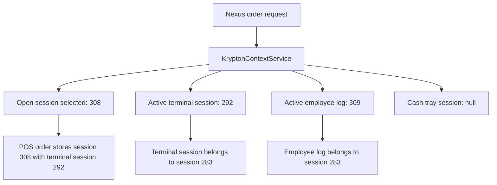

# CASE FILE: Staging-Like Krypton Validation

**Date:** 2026-05-06  
**Investigator:** Ranpo Edogawa  
**Scope:** `woosoo-nexus` API order flow into third-party `krypton_woosoo`  
**Mode:** Staging data creation plus read-only reconciliation  

## Executive Summary

Two staging tablet devices were normalized and used to create real orders through the device API path. Both initial orders were persisted correctly into Nexus and Krypton across:

- `device_orders`
- `device_order_items`
- `print_events`
- `krypton_woosoo.orders`
- `krypton_woosoo.order_checks`
- `krypton_woosoo.table_orders`
- `krypton_woosoo.ordered_menus`

The duplicate guard worked for Device A: replaying the same idempotency key returned the cached 201 response, and a second key for the same confirmed order returned 409 without creating another POS order.

One concrete data-integrity gap was found: refill-created POS line item `ordered_menus.id = 332123` for order `19644` has `order_check_id = NULL`. Initial order line items are correctly linked to their `order_checks` rows.

## Staging Inputs

Devices were normalized in the Nexus app database:

| Device | Local ID | POS Table | IP | Token Scope |
|---|---:|---:|---|---|
| Staging Audit Tablet T1 | 199 | 19 / T1 | `192.168.100.51` | temporary `staging-krypton-validation` |
| Staging Audit Tablet T2 | 542 | 20 / T2 | `192.168.100.52` | temporary `staging-krypton-validation` |

Temporary validation tokens were deleted after the run (`before = 2`, `after = 0`).

Order payloads:

| Case | Device | Items | Expected Subtotal | Expected Tax | Expected Total |
|---|---|---|---:|---:|---:|
| Initial A | T1 | Classic Feast x1, Coke Zero x2 | 499.00 | 49.90 | 548.90 |
| Initial B | T2 | Sauteed Beef with Broccoli x2, Lemon Chicken x1 | 730.00 | 73.00 | 803.00 |
| Refill A | T1 | Sauteed Beef with Broccoli x2 | 480.00 | 48.00 | 528.00 line subtotal |

## API Results

| Action | Status | Result |
|---|---:|---|
| Device A initial order | 201 | Local `device_orders.id = 142`, POS `orders.id = 19644` |
| Device A same-key duplicate | 201 | `X-Idempotent-Replay: true`, same local/POS order |
| Device A new-key duplicate | 409 | Existing confirmed order blocks duplicate creation |
| Device B initial order | 201 | Local `device_orders.id = 151`, POS `orders.id = 19645` |
| Device A refill | 200 | Local refill item created; POS `ordered_menus.id = 332123` created |

Note: multiple in-process Laravel HTTP kernel requests reused auth state during the first run. Device B was rerun in a fresh PHP process; the fresh run correctly authenticated as device `542`.

## Reconciliation Evidence

### Local Nexus Orders

| Local ID | Device | Table | POS Order | Status | Subtotal | Tax | Total | Session | Terminal Session |
|---:|---:|---:|---:|---|---:|---:|---:|---:|---:|
| 142 | 199 | 19 | 19644 | confirmed | 499.0000 | 49.9000 | 548.9000 | 308 | 292 |
| 151 | 542 | 20 | 19645 | confirmed | 730.0000 | 73.0000 | 803.0000 | 308 | 292 |

### Krypton POS Orders

| POS Order | Table | Check | Check Total | Check Subtotal | Check Tax | Employee Logs | Cash Tray |
|---:|---|---:|---:|---:|---:|---|---|
| 19644 | T1 / 19 | 19643 | 548.90 | 499.00 | 49.90 | start/current/close/server = 309 | NULL |
| 19645 | T2 / 20 | 19644 | 803.00 | 730.00 | 73.00 | start/current/close/server = 309 | NULL |

### Krypton POS Items

| POS Item | POS Order | Menu | Qty | Price | Original Price | Tax | Subtotal | Order Check |
|---:|---:|---:|---:|---:|---:|---:|---:|---|
| 332121 | 19644 | 46 | 1 | 449 | 449 | 44.90 | 493.90 | 19643 |
| 332122 | 19644 | 36 | 2 | 25 | 25 | 5.00 | 55.00 | 19643 |
| 332123 | 19644 | 10 | 2 | 240 | 240 | 48.00 | 528.00 | NULL |
| 332124 | 19645 | 10 | 2 | 240 | 240 | 48.00 | 528.00 | 19644 |
| 332125 | 19645 | 13 | 1 | 250 | 250 | 25.00 | 275.00 | 19644 |

### Print Events

| Print Event | Local Order | Type | Backend Status | Metadata |
|---:|---:|---|---|---|
| 448 | 142 | INITIAL | pending | `[]` |
| 449 | 142 | REFILL | pending | Includes Sauteed Beef with Broccoli x2 |
| 450 | 151 | INITIAL | pending | `[]` |

## Stored Procedure Contract

Live `information_schema.parameters` confirms current code aligns to the stored procedure arity:

| Procedure | Parameter Count |
|---|---:|
| `create_order` | 20 |
| `create_order_check` | 28 |
| `create_table_order` | 3 |
| `create_ordered_menu` | 48 |

## 2025 Baseline Comparison

Native Krypton 2025 baseline:

| Metric | Count |
|---|---:|
| Orders opened in 2025 | 12,175 |
| With `order_checks` | 12,168 |
| With `table_orders` | 12,165 |
| With menu rows | 12,152 |
| `start_employee_log_id IS NULL` | 0 |
| `current_employee_log_id IS NULL` | 0 |
| `server_employee_log_id IS NULL` | 12,174 |
| `cashier_employee_id IS NULL` | 6 |
| `cash_tray_session_id IS NULL` | 10 |
| `end_terminal_id IS NULL` | 7 |

Interpretation:

- `server_employee_log_id = 309` on the staging orders is stricter than the 2025 native baseline, where nearly all rows are NULL. This is not invalid by schema, but it differs from historical Krypton behavior.
- `cash_tray_session_id = NULL` is rare but present in native 2025 data, so it is not automatically invalid.
- Initial order item `order_check_id` linkage is stronger than some native historical rows.
- Refill item `order_check_id = NULL` is allowed by schema and appears in historical data, but it is inconsistent with this run's initial-order rows and weakens check-level reconciliation.

## Current Context Concern

`KryptonContextService` returned:

```json
{
  "session_id": 308,
  "terminal_session_id": 292,
  "employee_log_id": 309,
  "cash_tray_session_id": null,
  "terminal_service_id": 1,
  "server_employee_log_id": 309
}
```

Previous live inspection showed active terminal session `292`, employee log `309`, and cash tray `284` are tied to older POS session `283`, while the open POS session selected by Nexus is `308`.

This creates a staging-order context mismatch:



## Findings

### P1: Refill POS rows are missing `order_check_id`

`OrderApiController::refill()` passes:

```php
'order_check_id' => $deviceOrder->order_check_id ?? null,
```

The runtime `device_orders` table has no `order_check_id` column, so refill rows are created with `NULL` check linkage. Evidence: POS item `332123` for order `19644`.

Impact:

- Check-level item reconciliation cannot associate refill line items with `order_checks`.
- Refills behave differently from initial-order items in the same order.

Recommended fix:

- Resolve the latest POS `order_checks.id` by `order_id` during refill creation, or persist `order_check_id` locally when initial order creation succeeds.
- Add a regression test that creates a refill and asserts the POS `ordered_menus.order_check_id` equals the order's POS check ID.

### P2: Local initial item mirror stores menu ID, not POS ordered menu ID

Initial local rows store:

- `ordered_menu_id = 46` for menu 46
- `ordered_menu_id = 36` for menu 36
- `ordered_menu_id = 10` for menu 10
- `ordered_menu_id = 13` for menu 13

Refill local row stores the actual POS row ID:

- `ordered_menu_id = 332123`

Impact:

- The local column has inconsistent semantics between initial orders and refills.
- Any code that expects `device_order_items.ordered_menu_id` to reference `krypton_woosoo.ordered_menus.id` will fail for initial items.

Recommended fix:

- Choose one contract: either package/menu ID or POS ordered menu row ID.
- Rename or split fields if both are needed.

### P2: Context session mismatch remains unresolved

Orders `19644` and `19645` use `session_id = 308` and `terminal_session_id = 292`. The latter appears historically tied to `session_id = 283`.

Impact:

- POS reports that group by session and terminal session may produce inconsistent results.
- `cash_tray_session_id` remains NULL because lookup is based on session 308, while the visible open cash tray belongs to session 283.

Recommended fix:

- Make `KryptonContextService` select a coherent context tuple: session, terminal session, employee log, cash tray session, and terminal service must belong to the same active POS session where the schema provides that relation.

## Validation Gates

| Gate | Result |
|---|---|
| Every local `device_orders.order_id` exists in POS `orders` | PASS |
| Each initial POS order has matching `order_checks` | PASS |
| Each initial POS order has matching `table_orders` | PASS |
| `table_orders.table_id` matches device table | PASS |
| Initial `ordered_menus` have price/original price/tax/subtotal populated | PASS |
| Duplicate same-key request creates no extra POS order | PASS |
| Duplicate new-key request creates no extra POS order | PASS |
| Refill creates local item and print event | PASS |
| Refill POS row has `order_check_id` | FAIL |
| Context fields belong to one coherent POS session | FAIL |

## Recommended Next Patch

1. Add failing regression coverage for refill `order_check_id` propagation.
2. Update refill flow to resolve the POS check ID from `order_checks` when local `device_orders` lacks the field.
3. Add a context-coherence guard in `KryptonContextService`.
4. Decide the intended meaning of `device_order_items.ordered_menu_id` and make initial/refill behavior consistent.

## Remediation Applied

Implemented on 2026-05-06:

- `KryptonContextService` now prefers the active terminal-session tuple and derives `session_id`, `cash_tray_session_id`, and employee context from that coherent POS state.
- `server_employee_log_id` is intentionally stored as `NULL` for new automated orders to match the native Krypton historical pattern.
- New automated order `reference` values include concise device metadata: `woosoo device:{id} ip:{ip_address}`.
- Refill creation now resolves the POS `order_checks.id` by `order_id` and passes it into `CreateOrderedMenu`, fixing `ordered_menus.order_check_id`.
- Regression coverage added in `tests/Feature/Api/V1/StagingKryptonOrderDataContractTest.php`.

Verified:

- `php artisan test tests\Feature\Api\V1\StagingKryptonOrderDataContractTest.php tests\Feature\OrderRefillTest.php tests\Feature\OrderCreateAndRefillTest.php tests\Feature\Api\V1\ShowByExternalIdScopingTest.php`
- `vendor\bin\pint.bat --test ...` for touched files
