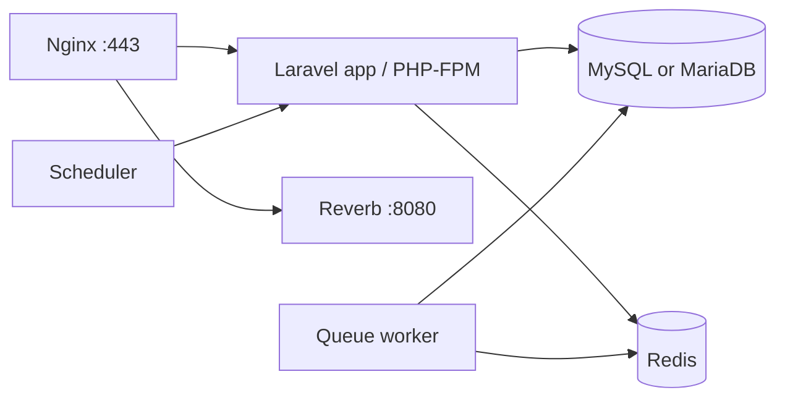

# Docker-First Deployment Decision

Woosoo on-premise Raspberry Pi deployments should use Docker Compose.

Native Linux installation is possible, but it is not the recommended production path for this project.

---

## Decision

Use Docker Compose for the Raspberry Pi server.

Recommended service layout:

```txt
nginx        HTTPS reverse proxy
app          Laravel / PHP-FPM
mysql        app database
redis        cache, queues, sessions
reverb       WebSocket server
queue        Laravel queue worker
scheduler    Laravel scheduled tasks
```



---

## Why Docker

### 1. Repeatable deployment

The deployment becomes file-based instead of scattered across the operating system.

Important deployment state lives in predictable places:

```txt
/etc/woosoo/woosoo.env
/opt/woosoo/woosoo-nexus/.env
docker-compose.yml
docker/nginx/default.conf
Docker volumes or database backups
```

This makes deployment easier to rebuild, review, troubleshoot, and transfer.

### 2. Easier migration from microSD to M.2 SSD

It is acceptable to rehearse the deployment on microSD while waiting for the SSD.

When the SSD arrives, the clean production path is:

```txt
1. Install fresh Raspberry Pi OS on the SSD
2. Install Docker
3. Clone woosoo-nexus
4. Copy /etc/woosoo/woosoo.env
5. Run scripts/deployment/apply-woosoo-config.sh
6. Restore database backup if needed
7. Start Docker Compose
```

This avoids dragging old microSD experiments into production.

### 3. Easier recovery

If the Pi or storage fails, recovery is straightforward:

```txt
1. Install Raspberry Pi OS
2. Install Docker
3. Clone repo
4. Copy woosoo.env
5. Restore database backup
6. docker compose up -d
```

Without Docker, recovery requires remembering every package, PHP extension, Nginx file, database setting, Redis setting, Reverb service, queue worker, and scheduler service configured manually.

### 4. Service isolation

Each service can be inspected and restarted independently:

```bash
docker compose ps
docker compose logs nginx --tail=100
docker compose logs reverb --tail=100
docker compose restart queue
docker compose restart reverb
```

### 5. Better fit for the Woosoo stack

Woosoo has multiple server components:

```txt
Laravel API
Nginx
MySQL or MariaDB
Redis
Reverb
queue worker
scheduler
POS integration
print bridge integration
```

Docker keeps those pieces organized and portable.

---

## What Docker Does Not Solve

Docker does not replace basic production discipline.

Still required:

```txt
M.2 SSD for production storage
stable Raspberry Pi IP
local DNS for woosoo.local
proper HTTPS certificate
backup script
health check script
reboot testing
cooling and reliable power
```

Docker makes deployment cleaner, but it does not protect data by itself. Backups are mandatory.

---

## microSD Usage Policy

microSD is acceptable for staging and rehearsal only.

Good microSD use:

```txt
install Docker
clone repo
test dnsmasq
test woosoo.local
test Nginx/Reverb routing
dry-run deployment scripts
```

Avoid final production use on microSD:

```txt
production MySQL/MariaDB writes
high-volume logs
constant order traffic
long-running database load
```

Production should run on the M.2 SSD.

---

## Native Linux Setup

Native installation means manually installing and configuring:

```txt
nginx
php-fpm
php extensions
mysql/mariadb
redis
systemd services for queue/reverb/scheduler
log rotation
permissions
```

Native setup can be slightly lighter, but it is harder to reproduce and easier to misconfigure.

Use native Linux only if Docker is not available or there is a hard operational requirement against containers.

For normal Woosoo Raspberry Pi deployments, use Docker Compose.
