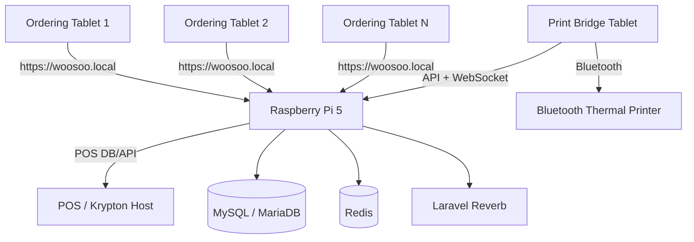
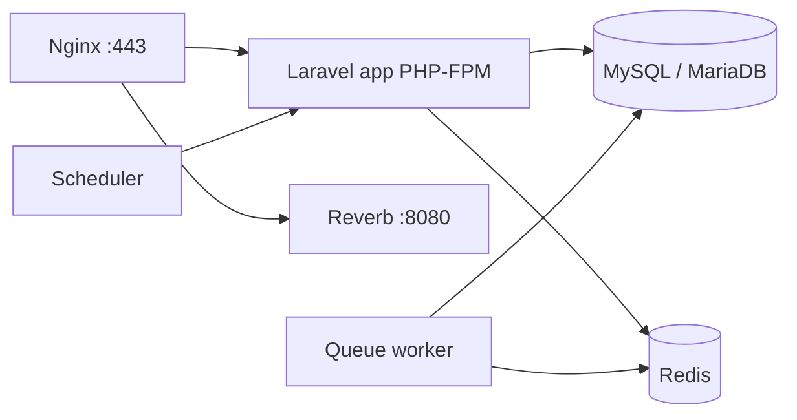

# Woosoo On-Premise Raspberry Pi Deployment Specification

> Target audience: installer/developer deploying Woosoo Nexus on a local restaurant network.
>
> Goal: tablets only open `https://woosoo.local`, while the Raspberry Pi hosts the backend, local DNS, WebSockets, queues, database, and integration services.

---

## 1. Target Architecture

```txt
Ordering Tablets
  DHCP from existing router
  Manual DNS = Raspberry Pi IP
  Browser/PWA URL = https://woosoo.local
        │
        ▼
Raspberry Pi 5
  Static LAN IP configured locally
  dnsmasq resolves woosoo.local
  Nginx HTTPS reverse proxy
  Docker Compose stack
  Laravel / Reverb / Redis / MySQL
        │
        ├── POS / Krypton database or API by configured POS IP
        │
        ▼
Print Bridge Tablet
  Server URL = https://woosoo.local
  Receives print events or polls unprinted orders
  Prints through Bluetooth thermal printer
```



---

## 2. Deployment Rules

1. Tablets must never use the raw server IP in normal operation.
2. Tablets must access only `https://woosoo.local`.
3. Router access is not required.
4. Raspberry Pi must use a stable static LAN IP configured on the Pi.
5. Tablets manually use the Pi IP as DNS.
6. `dnsmasq` on the Pi resolves `woosoo.local` to the Pi IP.
7. Reverb/WebSocket traffic must go through Nginx over HTTPS/WSS.
8. Print bridge talks to `https://woosoo.local`, not to the printer through the backend.
9. The Bluetooth printer is controlled only by the print bridge tablet.
10. Database backups must be automated.

---

## 3. Hardware Requirements

### Required

- Raspberry Pi 5, preferably 8GB RAM
- M.2/NVMe SSD through a Raspberry Pi 5 compatible HAT
- Official or high-quality USB-C power supply
- Active cooler
- Ethernet cable
- Android tablets for ordering
- One Android relay tablet for print bridge
- Bluetooth thermal printer

### Strongly Recommended

- UPS for the Raspberry Pi and network equipment
- Dedicated Wi-Fi access point for ordering tablets
- Spare microSD/SSD image or spare Pi for recovery

---

## 4. Network Plan Without Router Access

Example LAN values:

```txt
Router/gateway:       192.168.100.1
Raspberry Pi server:  192.168.100.10
POS host:             192.168.100.20
Tablet DNS:           192.168.100.10
Tablet URL:           https://woosoo.local
```

The router still gives tablets their IP addresses through DHCP. The only manual tablet change is DNS.

```txt
Tablet IP settings: DHCP
Tablet DNS 1:      192.168.100.10
Tablet DNS 2:      blank or 192.168.100.10
```

Do not set DNS 2 to `8.8.8.8`, because some devices may bypass the Pi and fail to resolve `woosoo.local`.

---

## 5. Installation Order

Install in this order:

1. Flash Raspberry Pi OS 64-bit to the M.2 SSD.
2. Boot the Pi from the M.2 SSD.
3. Enable SSH.
4. Update the OS.
5. Install Docker and Docker Compose.
6. Clone `woosoo-nexus`.
7. Create `/etc/woosoo/woosoo.env`.
8. Run `apply-woosoo-config.sh`.
9. Generate/install HTTPS certificate.
10. Start Docker stack.
11. Run migrations.
12. Configure tablets to use Pi DNS.
13. Test `https://woosoo.local`.
14. Configure print bridge server URL to `https://woosoo.local`.
15. Run print test.
16. Enable backups and health checks.
17. Reboot and verify recovery.

---

## 6. Base OS Setup

```bash
sudo apt update
sudo apt full-upgrade -y
sudo reboot
```

After reboot:

```bash
sudo apt install -y git curl ca-certificates dnsutils nano unzip
```

Set timezone:

```bash
sudo timedatectl set-timezone Asia/Manila
```

---

## 7. Install Docker

```bash
curl -fsSL https://get.docker.com | sh
sudo usermod -aG docker $USER
sudo systemctl enable docker
sudo systemctl start docker
```

Log out and back in, then verify:

```bash
docker --version
docker compose version
```

---

## 8. Clone Project

```bash
sudo mkdir -p /opt/woosoo
sudo chown -R $USER:$USER /opt/woosoo
cd /opt/woosoo

git clone https://github.com/tech-artificer/woosoo-nexus.git
cd woosoo-nexus
```

---

## 9. One-File Configuration

Create:

```bash
sudo mkdir -p /etc/woosoo
sudo nano /etc/woosoo/woosoo.env
```

Example:

```bash
WOOSOO_HOST="woosoo.local"
WOOSOO_SERVER_IP="192.168.100.10"
WOOSOO_GATEWAY="192.168.100.1"
WOOSOO_CIDR="24"
WOOSOO_DNS_FORWARDERS="1.1.1.1 8.8.8.8"
WOOSOO_NM_CONNECTION=""

WOOSOO_NEXUS_PATH="/opt/woosoo/woosoo-nexus"
WOOSOO_DOCKER_COMPOSE="docker compose"

WOOSOO_SCHEME="https"
WOOSOO_TIMEZONE="Asia/Manila"

WOOSOO_POS_HOST="192.168.100.20"
WOOSOO_POS_PORT="3308"
WOOSOO_POS_DATABASE="krypton_woosoo"
WOOSOO_POS_USERNAME="root"
WOOSOO_POS_PASSWORD=""

WOOSOO_DB_DATABASE="woosoo"
WOOSOO_DB_USERNAME="woosoo"
WOOSOO_DB_PASSWORD="change_this_password"

WOOSOO_REVERB_APP_ID="woosoo"
WOOSOO_REVERB_APP_KEY="change_this_reverb_key"
WOOSOO_REVERB_APP_SECRET="change_this_reverb_secret"

WOOSOO_ALIASES="api.woosoo.local tablet.woosoo.local"

WOOSOO_APP_SERVICE="app"
WOOSOO_NGINX_SERVICE="nginx"
WOOSOO_REVERB_SERVICE="reverb"
WOOSOO_QUEUE_SERVICE="queue"
WOOSOO_SCHEDULER_SERVICE="scheduler"
WOOSOO_MYSQL_SERVICE="mysql"

WOOSOO_BACKUP_DIR="/opt/woosoo/backups"
WOOSOO_APPLY_STATIC_IP="true"
WOOSOO_RESTART_DOCKER="true"
```

---

## 10. Deployment Automation Scripts

Place scripts in:

```txt
scripts/deployment/
```

Required scripts:

```txt
scripts/deployment/apply-woosoo-config.sh
scripts/deployment/woosoo-health.sh
scripts/deployment/woosoo-backup.sh
```

The apply script configures:

- static IP with NetworkManager
- dnsmasq local DNS
- `/etc/hosts` fallback
- Laravel `.env`
- Nginx config
- Docker restart
- Laravel cache refresh
- DNS/HTTPS/container health checks

---

## 11. Static IP

The Pi must keep a stable IP. Because router access may not be available, configure it on the Pi.

Check active connections:

```bash
nmcli connection show
```

Manual example:

```bash
sudo nmcli connection modify "Wired connection 1" \
  ipv4.addresses 192.168.100.10/24 \
  ipv4.gateway 192.168.100.1 \
  ipv4.dns "1.1.1.1 8.8.8.8" \
  ipv4.method manual

sudo nmcli connection up "Wired connection 1"
```

Verify:

```bash
ip -4 addr
ip route
```

---

## 12. dnsmasq Local DNS

Install:

```bash
sudo apt install -y dnsmasq dnsutils
```

Config:

```bash
sudo nano /etc/dnsmasq.d/woosoo.conf
```

```conf
address=/woosoo.local/192.168.100.10
address=/api.woosoo.local/192.168.100.10
address=/tablet.woosoo.local/192.168.100.10
server=1.1.1.1
server=8.8.8.8
```

Validate:

```bash
sudo dnsmasq --test
sudo systemctl restart dnsmasq
sudo systemctl enable dnsmasq

dig woosoo.local @127.0.0.1 +short
```

Expected:

```txt
192.168.100.10
```

---

## 13. HTTPS Certificate

Recommended: `mkcert`.

Generate cert with hostname and IP:

```bash
mkcert woosoo.local api.woosoo.local tablet.woosoo.local 192.168.100.10
```

Place files where Nginx expects them:

```txt
docker/certs/woosoo.crt
docker/certs/woosoo.key
```

Install the mkcert root CA on all tablets. Without this, Android/browser may show certificate warnings.

---

## 14. Laravel Environment

The deployment script should write these key values:

```env
PUBLIC_SCHEME=https
PUBLIC_HOST=woosoo.local
PUBLIC_HTTP_PORT=80
PUBLIC_HTTPS_PORT=443

APP_ENV=production
APP_DEBUG=false
APP_URL=https://woosoo.local
APP_TIMEZONE=Asia/Manila

DB_HOST=mysql
REDIS_HOST=redis
QUEUE_CONNECTION=redis
SESSION_DRIVER=redis
CACHE_DRIVER=redis

DB_POS_HOST=192.168.100.20
DB_POS_PORT=3308

BROADCAST_DRIVER=reverb
REVERB_HOST=0.0.0.0
REVERB_PUBLIC_HOST=woosoo.local
REVERB_PORT=8080
REVERB_SCHEME=http

VITE_REVERB_HOST=woosoo.local
VITE_REVERB_PORT=443
VITE_REVERB_SCHEME=https

SANCTUM_STATEFUL_DOMAINS=woosoo.local,woosoo.local:443,woosoo.local:80
CORS_ALLOWED_ORIGINS=https://woosoo.local,http://woosoo.local
```

---

## 15. Nginx Responsibilities

Nginx must:

- serve Laravel over HTTPS
- redirect HTTP to HTTPS
- proxy WebSocket traffic to Reverb
- hide internal ports from tablets

Reverb should be reached by clients as:

```txt
wss://woosoo.local/app/...
```

not:

```txt
http://woosoo.local:8080
```

---

## 16. Docker Services

Recommended services:

```txt
nginx
app
mysql
redis
reverb
queue
scheduler
```



All containers should use `restart: unless-stopped`.

---

## 17. Run Migrations and Optimize

```bash
cd /opt/woosoo/woosoo-nexus

docker compose up -d --build
docker compose exec app composer install --no-dev --optimize-autoloader
docker compose exec app php artisan key:generate
docker compose exec app php artisan migrate --force
docker compose exec app php artisan storage:link || true
docker compose exec app php artisan config:cache
docker compose exec app php artisan route:cache
docker compose exec app php artisan view:cache
```

---

## 18. Tablet Setup

For each tablet:

1. Join restaurant Wi-Fi.
2. Open Wi-Fi network advanced settings.
3. Keep IP assignment as DHCP.
4. Set DNS 1 to the Pi IP.
5. Set DNS 2 blank or same as DNS 1.
6. Open browser.
7. Visit `https://woosoo.local`.
8. Install PWA if needed.

Expected result:

```txt
Tablet resolves woosoo.local → Pi IP
Tablet loads PWA/admin over HTTPS
WebSocket connects over WSS
```

---

## 19. Print Bridge Setup

On the relay tablet:

```txt
Server URL: https://woosoo.local
Printer: paired Bluetooth thermal printer
```

Expected flow:

```txt
1. Order created by tablet
2. Backend broadcasts print event
3. Print bridge receives event
4. Print bridge prints via Bluetooth
5. Print bridge marks order as printed
```

Fallback flow:

```txt
If WebSocket is missed:
  print bridge calls /api/orders/unprinted
  prints pending orders
  confirms printed status
```

---

## 20. Health Check

Run:

```bash
sudo bash scripts/deployment/woosoo-health.sh
```

It should check:

- expected Pi IP exists
- dnsmasq is active
- `woosoo.local` resolves
- ports 53/80/443 are listening
- HTTPS responds
- Docker containers are running
- disk space
- memory
- temperature
- recent dnsmasq logs

---

## 21. Backup

Run manually:

```bash
sudo bash scripts/deployment/woosoo-backup.sh
```

Recommended cron:

```cron
0 3 * * * /bin/bash /opt/woosoo/woosoo-nexus/scripts/deployment/woosoo-backup.sh >> /var/log/woosoo-backup.log 2>&1
```

Backups should be stored under:

```txt
/opt/woosoo/backups/db
```

Retain at least 14 days.

---

## 22. Reboot Survival Test

Run:

```bash
sudo reboot
```

After reboot:

```bash
sudo bash scripts/deployment/woosoo-health.sh
```

Pass criteria:

```txt
Pi has expected IP
dnsmasq active
woosoo.local resolves
Docker containers running
https://woosoo.local responds
Reverb route does not return 502
Disk has free space
Temperature is sane
```

---

## 23. Troubleshooting

### Tablet cannot open woosoo.local

Check tablet DNS:

```txt
DNS 1 must be Pi IP
DNS 2 must be blank or Pi IP
```

Check Pi DNS:

```bash
dig woosoo.local @127.0.0.1 +short
sudo systemctl status dnsmasq
```

### HTTPS warning

Install the mkcert root CA on the tablet.

### WebSocket fails

Check Reverb container:

```bash
docker compose ps
docker compose logs reverb --tail=100
```

Check Nginx `/app/` proxy.

### Orders save but do not print

Check:

- print bridge server URL
- print bridge device token
- Bluetooth printer pairing
- backend unprinted order endpoint
- print bridge heartbeat

### POS sync fails

Check:

```bash
ping <POS IP>
nc -zv <POS IP> <POS PORT>
```

Then verify `DB_POS_*` values.

---

## 24. Acceptance Checklist

```txt
[ ] Pi boots from M.2 SSD
[ ] Pi has stable static IP
[ ] dnsmasq resolves woosoo.local
[ ] Tablet DNS points to Pi
[ ] Tablet loads https://woosoo.local
[ ] HTTPS certificate trusted or accepted
[ ] Docker stack starts after reboot
[ ] Laravel app responds
[ ] Reverb works through WSS
[ ] Queue worker running
[ ] Scheduler running
[ ] POS connection configured
[ ] Print bridge connects to backend
[ ] Bluetooth printer test succeeds
[ ] Unprinted fallback tested
[ ] Backup script tested
[ ] Health script passes after reboot
```

---

## 25. Operational Rule

If the site changes network, edit only:

```txt
/etc/woosoo/woosoo.env
```

Then run:

```bash
sudo bash scripts/deployment/apply-woosoo-config.sh
```

Do not edit random config files by hand unless debugging.
