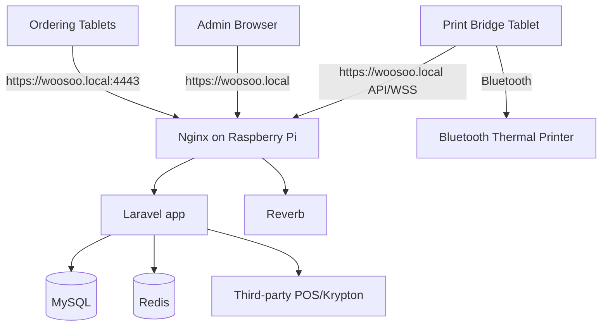

# Woosoo On-Premise Raspberry Pi Deployment Runbook

This runbook deploys `woosoo-nexus` on a Raspberry Pi 5 for local restaurant use.

Current staging Docker layout:

```txt
Admin/API/Reverb: https://woosoo.local
Tablet PWA:       https://woosoo.local:4443
Print bridge:     https://woosoo.local
```

The tablet PWA is currently served by the `tablet-pwa` service in `compose.yaml` and proxied by Nginx on port `4443`.

---

## Architecture



---

## Hardware

Required:

```txt
Raspberry Pi 5
M.2/NVMe SSD
Active cooling
Reliable USB-C power supply
Ethernet connection
Android ordering tablets
Android print bridge tablet
Bluetooth thermal printer
```

Recommended:

```txt
UPS
Dedicated Wi-Fi AP for tablets
Spare SSD image or backup Pi
```

---

## Network Model Without Router Access

The router still provides DHCP to tablets, but tablets manually use the Pi as DNS.

Example:

```txt
Router/gateway:       192.168.100.1
Raspberry Pi server:  192.168.100.10
POS host:             192.168.100.20
Tablet DNS 1:         192.168.100.10
Tablet DNS 2:         blank or 192.168.100.10
```

Never set public DNS such as `8.8.8.8` as tablet DNS 2. Some devices may bypass the Pi and fail to resolve `woosoo.local`.

---

## Installation Order

1. Flash Raspberry Pi OS 64-bit to the M.2 SSD.
2. Boot the Pi from the SSD.
3. Enable SSH if needed.
4. Update the OS.
5. Install Docker.
6. Clone `woosoo-nexus` and check out `staging`.
7. Make deployment scripts executable.
8. Copy and edit `/etc/woosoo/woosoo.env`.
9. Secure `/etc/woosoo/woosoo.env` permissions.
10. Generate TLS certs in `docker/certs`.
11. Run `scripts/deployment/apply-woosoo-config.sh`.
12. Start the Docker stack using `compose.yaml`.
13. Run first-install Laravel commands and migrations.
14. Configure tablet DNS.
15. Test admin, tablet PWA, Reverb, print bridge, and backups.
16. Reboot and run the health check.

---

## Base OS Setup

```bash
sudo apt update
sudo apt full-upgrade -y
sudo reboot
```

After reboot:

```bash
sudo apt install -y git curl ca-certificates dnsutils nano unzip
sudo timedatectl set-timezone Asia/Manila
```

---

## Install Docker

```bash
curl -fsSL https://get.docker.com | sh
sudo usermod -aG docker $USER
sudo systemctl enable docker
sudo systemctl start docker
```

Log out and back in, then verify:

```bash
docker --version
docker compose version
```

---

## Clone Repository

```bash
sudo mkdir -p /opt/woosoo
sudo chown -R $USER:$USER /opt/woosoo
cd /opt/woosoo

git clone https://github.com/tech-artificer/woosoo-nexus.git
git clone https://github.com/tech-artificer/tablet-ordering-pwa.git
```

Check out staging branches:

```bash
cd /opt/woosoo/woosoo-nexus
git checkout staging
git pull origin staging

cd /opt/woosoo/tablet-ordering-pwa
git checkout staging
git pull origin staging

cd /opt/woosoo/woosoo-nexus
```

Make the deployment scripts executable:

```bash
chmod +x scripts/deployment/apply-woosoo-config.sh
chmod +x scripts/deployment/woosoo-backup.sh
chmod +x scripts/deployment/woosoo-health.sh
```

The staging branch already includes:

```txt
compose.yaml
Dockerfile
docker/nginx/default.conf
docker/php/zzz-app.conf
docker/certs/README.md
docker/certs/generate-dev-certs.sh
```

Important: `compose.yaml` builds the tablet PWA from `../tablet-ordering-pwa`. Both repos must be siblings under `/opt/woosoo`.

---

## Configure One File

```bash
sudo mkdir -p /etc/woosoo
sudo cp docs/deployment/examples/woosoo.env.example /etc/woosoo/woosoo.env
sudo nano /etc/woosoo/woosoo.env
sudo chown root:root /etc/woosoo/woosoo.env
sudo chmod 600 /etc/woosoo/woosoo.env
```

Important values:

```bash
WOOSOO_HOST="woosoo.local"
WOOSOO_SERVER_IP="192.168.100.10"
WOOSOO_GATEWAY="192.168.100.1"
WOOSOO_POS_HOST="192.168.100.20"
WOOSOO_DOCKER_COMPOSE="docker compose -f compose.yaml"
```

---

## TLS Certificates

The current Nginx config expects these files inside the container:

```txt
/etc/nginx/certs/fullchain.pem
/etc/nginx/certs/privkey.pem
```

`compose.yaml` mounts the host directory:

```yaml
./docker/certs:/etc/nginx/certs:ro
```

So the host files must be:

```txt
docker/certs/fullchain.pem
docker/certs/privkey.pem
```

For development/self-signed certs, use the existing helper in `docker/certs`:

```bash
cd docker/certs
chmod +x generate-dev-certs.sh
./generate-dev-certs.sh 192.168.100.10
cd ../..
```

Install/trust the generated certificate authority or certificate on each tablet as needed.

---

## Apply Host Configuration

Run from the repo root:

```bash
sudo bash scripts/deployment/apply-woosoo-config.sh
```

This configures:

```txt
static Pi IP through NetworkManager
dnsmasq local DNS
/etc/hosts fallback
Laravel .env values
certificate directory check
Docker stack startup/cache refresh
```

When running over SSH, the script refuses to change the active network IP unless `FORCE_APPLY_STATIC_IP=true` is set.

On first-time Pi builds, Docker image pulls/builds can take several minutes. If the script warns that the app service is not ready yet, let Docker finish and rerun the script.

The script warns if `APP_KEY` is missing. Before first production use, run `php artisan key:generate` as shown below.

---

## First Install Laravel Commands

```bash
docker compose -f compose.yaml up -d --build
docker compose -f compose.yaml exec app composer install --no-dev --optimize-autoloader
```

Only run this on first install:

```bash
docker compose -f compose.yaml exec app php artisan key:generate
```

Do not run `key:generate` again on an existing production database unless intentionally rotating `APP_KEY`.

Then run:

```bash
docker compose -f compose.yaml exec app php artisan migrate --force
docker compose -f compose.yaml exec app php artisan storage:link || true
docker compose -f compose.yaml exec app php artisan config:cache
docker compose -f compose.yaml exec app php artisan route:cache
docker compose -f compose.yaml exec app php artisan view:cache
```

---

## Tablet Setup

For each ordering tablet:

```txt
Wi-Fi IP assignment: DHCP
DNS 1:               Raspberry Pi IP, e.g. 192.168.100.10
DNS 2:               blank or same Pi IP
Tablet URL:          https://woosoo.local:4443
```

---

## Print Bridge Setup

The print bridge tablet pairs to the Bluetooth printer and talks to the backend through:

```txt
https://woosoo.local
```

The Bluetooth printer should not be paired directly to the Raspberry Pi.

---

## Health Check

```bash
sudo bash scripts/deployment/woosoo-health.sh
```

Checks include:

```txt
expected Pi IP
dnsmasq
woosoo.local resolution
ports 53/80/443/4443
admin HTTPS
tablet PWA HTTPS
Reverb proxy route
Docker containers
disk/memory/temperature
```

---

## Backup

Manual backup:

```bash
sudo bash scripts/deployment/woosoo-backup.sh
```

Cron example:

```cron
0 3 * * * /bin/bash /opt/woosoo/woosoo-nexus/scripts/deployment/woosoo-backup.sh >> /var/log/woosoo-backup.log 2>&1
```

Default retention is controlled by:

```bash
WOOSOO_BACKUP_RETENTION_DAYS="14"
```

The backup script uses a lock file to prevent overlapping backups.

---

## Reverb Exposure

`REVERB_HOST=0.0.0.0` binds Reverb inside the Docker network. The Reverb service is not published directly to the host in `compose.yaml`; Nginx proxies WebSocket traffic through `https://woosoo.local/app`.

---

## Reboot Survival Test

```bash
sudo reboot
```

After reboot:

```bash
sudo bash scripts/deployment/woosoo-health.sh
```

Pass criteria:

```txt
Pi has expected IP
dnsmasq active
woosoo.local resolves
Docker containers running
https://woosoo.local responds
https://woosoo.local:4443 responds
Reverb route does not return 502
Disk has free space
Temperature is sane
```

---

## Access Summary

```txt
Admin/API:     https://woosoo.local
Tablet PWA:    https://woosoo.local:4443
Print bridge:  https://woosoo.local
Reverb/WSS:    wss://woosoo.local/app
```
