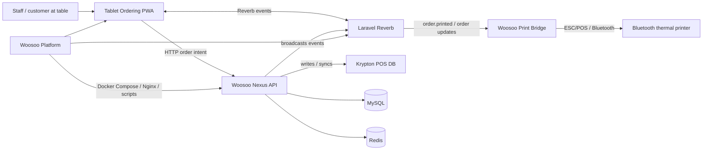
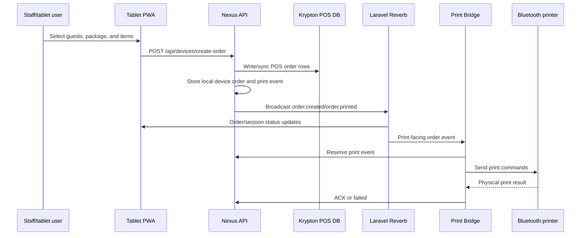

# Woosoo product documentation

## 1. Executive overview

Woosoo is a local restaurant ordering, POS synchronization, and receipt-printing system for Korean barbecue table service. It is built from three applications and one deployment platform:

- **Woosoo Nexus:** Laravel backend, admin panel, API hub, POS/Krypton integration, Reverb broadcaster, and print-event source.
- **Tablet Ordering PWA:** Nuxt 3 tablet app for staff/customer order entry.
- **Woosoo Print Bridge:** Flutter Android relay that receives print work and sends it to a paired Bluetooth thermal printer.
- **Woosoo Platform:** Deployment and infrastructure repository for Nexus and Tablet PWA, including Docker Compose, Nginx, certificates, environment templates, and orchestration scripts.

The system is LAN-first. Nexus owns business truth; the tablet sends customer intent; the Print Bridge owns last-mile print execution.

Core contract phrase: **Tablet sends intent only.** Nexus owns pricing, totals, modifiers, POS mapping, and order state.

## 2. Business goals

- Let staff take table orders from tablets without requiring internet access.
- Store order truth in Nexus and the Krypton POS database.
- Keep tablets synchronized with order/session status through Reverb and fallback recovery flows.
- Print kitchen/cashier receipts reliably through the Android Print Bridge.
- Provide admin tools for devices, menus, packages, reports, monitoring, and operational recovery.
- Support deployment, support, and handover through repeatable platform scripts and documented smoke checks.

## 3. User requirements

### 3.1 Restaurant operators

- Must run the system on the restaurant LAN.
- Must start service with Nexus, Tablet PWA, POS, Reverb, and Print Bridge healthy.
- Must verify one end-to-end order before service.
- Must have a rollback/recovery path if the system fails during operation.

### 3.2 Staff and tablet users

- Must be able to start a table session.
- Must select guest count, package, menu items, and refills.
- Must review an order before submission.
- Must see friendly errors, never stack traces or raw SQL errors.
- Must recover from tablet reloads, sleep/wake, and session-end events.

### 3.3 Admins and managers

- Must manage devices, users, menus, packages, tablet categories, and reports. (See [Package Builder + Tablet Category Spec](PACKAGE_BUILDER_AND_TABLET_CATEGORIES_SPEC.md) for the data model and API contract.)
- Must monitor active sessions, orders, print latency, print audit, and device health.
- Must reset or force-end sessions when operationally required.
- Must audit failed print events and POS connection issues.

### 3.4 Print relay operators

- Must configure server URL and device token.
- Must pair and test the Bluetooth printer.
- Must see queue, heartbeat, ACK backlog, and dead-letter status.
- Must retry or discard failed jobs with operator intent.

### 3.5 Developers

- Must understand app boundaries and contracts before changing code.
- Must verify routes, events, payloads, and environment keys against source.
- Must preserve backend-owned truth and tablet intent-only payloads.
- Must run the correct app validation gates.

### 3.6 DevOps maintainers

- Must deploy from the platform root.
- Must keep environment templates aligned with runtime compose interpolation.
- Must monitor Nginx, Reverb, app, queue, scheduler, MySQL, Redis, and Tablet PWA services.
- Must maintain rollback and smoke-test procedures.

### 3.7 Stakeholders

- Must understand current delivered scope, deferred scope, reliability posture, and operational dependencies.
- Must receive release notes that separate verified shipped work from pending or proposed work.

## 4. Main features and functionalities

### 4.1 Tablet ordering

- Device registration and token validation.
- Welcome screen with table/device context.
- Guest count and package selection.
- Menu browsing by categories.
- Cart/order review.
- Order submission through Nexus.
- In-session summary, refill, add-more-items, service request, and session-end screens.
- Reverb updates plus recovery/polling behavior for resilience.

### 4.2 Nexus backend and admin

- Device and user management.
- Tablet API endpoints.
- Order creation, lookup, refill, print, and session APIs.
- POS/Krypton integration.
- Reverb event publication.
- Print event generation and print audit.
- Reports for sales, menu items, order status, guest count, print audit, discount/tax, and hourly views.
- Monitoring for queue/database/Reverb health and operational controls.

### 4.3 POS/Krypton integration

- Nexus writes or synchronizes order and payment/session facts with the Krypton POS database.
- POS identity is authoritative for global order references.
- Production POS host is documented as static IP `192.168.1.32` in the platform context.
- POS writes are high-risk and must not be "undone" with compensating deletes.

### 4.4 Reverb realtime backbone

Nexus runs Laravel Reverb. Tablet PWA and Print Bridge connect as WebSocket clients.

Realtime events are used for:

- Order creation/status/detail updates.
- Terminal order/session events.
- Device control events.
- Service request notifications.
- Print-facing order events.

### 4.5 Print Bridge and receipt printing

- Receives print payloads through WebSocket and/or polling.
- Deduplicates by `print_event_id`.
- Reserves jobs server-side before printing when the print-event API is enabled.
- Prints through paired Bluetooth thermal printer.
- Sends ACK or failure status.
- Tracks queue, ACK backlog, dead letters, and printer health.

### 4.6 Platform deployment and operations

- Docker Compose orchestration from the platform root.
- Nginx routes Nexus admin/API, Reverb WebSocket, and Tablet PWA.
- MySQL and Redis services support local runtime.
- Queue and scheduler workers process background tasks.
- Deployment scripts apply config, deploy, and support operator checks.

## 5. System architecture

### 5.1 High-level architecture



### 5.2 Data ownership

| Data | Owner | Rule |
|---|---|---|
| Pricing, modifiers, totals, package rules | Nexus/POS | Tablet never sends these values. |
| Order state | Nexus/POS | Tablet never sends state. |
| Order intent | Tablet | Sent to Nexus as guest count, package ID, and menu quantities. |
| Print outcome | Print Bridge plus Nexus print event record | Bridge reports ACK/fail; Nexus records status. |
| Last-mile printer health | Print Bridge | Reported through heartbeat and UI status. |
| Deployment config | Platform root and Nexus `.env` | Do not leak secrets to tablet container or docs. |

## 6. Component deep dives

### 6.1 Woosoo Nexus

Technology stack:

- PHP 8.2+
- Laravel 12
- Laravel Sanctum
- Laravel Reverb
- Inertia + Vue 3
- Vite
- MySQL
- Redis
- Pest/PHPUnit

Responsibilities:

- Authenticate users and devices.
- Serve admin UI and APIs.
- Process tablet order submissions.
- Own order/session state.
- Integrate with Krypton POS.
- Broadcast Reverb events.
- Create and track print events.
- Provide reporting and monitoring.

Important files:

- `routes/api.php`
- `routes/api_printer_routes.php`
- `routes/channels.php`
- `app/Events/**`
- `app/Http/Controllers/Api/V1/**`
- `app/Services/**`
- `app/Enums/OrderStatus.php`

### 6.2 Tablet Ordering PWA

Technology stack:

- Nuxt 3
- Vue 3
- Pinia
- Laravel Echo
- Pusher JS client for Reverb protocol
- Vitest
- Playwright dependency for E2E work

Responsibilities:

- Register tablet devices.
- Collect staff/customer ordering intent.
- Display package/menu/order/session screens.
- Handle Reverb status and terminal events.
- Provide recovery from reload, service-worker, or connection problems.

Important files:

- `pages/`
- `stores/`
- `composables/useBroadcasts.ts`
- `plugins/echo.client.ts`
- `nuxt.config.ts`

### 6.3 Woosoo Print Bridge

Technology stack:

- Flutter
- Riverpod
- GoRouter
- `web_socket_channel`
- `http`
- `sembast`
- `blue_thermal_printer` local package

Responsibilities:

- Register/configure printer relay device.
- Subscribe to Reverb events.
- Poll unprinted events when needed.
- Store a durable local queue.
- Reserve jobs before print when supported.
- Print through Bluetooth.
- ACK or fail print events.
- Show queue, metrics, dead-letter, and status screens.

Important files:

- `lib/services/reverb_service.dart`
- `lib/services/api_service.dart`
- `lib/state/app_controller.dart`
- `lib/services/queue_store.dart`
- `lib/services/printer/printer_blue_thermal.dart`
- `lib/models/print_job.dart`

### 6.4 Woosoo Platform

Technology stack:

- Docker Compose
- Nginx
- Bash/PowerShell deployment scripts
- TLS certificates for LAN HTTPS

Responsibilities:

- Orchestrate Nexus and Tablet PWA.
- Route HTTPS admin/API, Tablet PWA, and Reverb WebSocket traffic.
- Provide environment templates and deployment scripts.
- Preserve deployment evidence and operator runbooks.

Important files:

- Root `compose.yaml`
- `docker/nginx/default.conf`
- `docker/certs/`
- `docs/deployment/`
- `scripts/deployment/`

## 7. Communication and contract reference

### 7.1 Tablet order submit

Current contract:

```http
POST /api/devices/create-order
Authorization: Bearer <device-token>
Content-Type: application/json
```

Intent-only payload:

```json
{
  "guest_count": 4,
  "package_id": 2,
  "items": [
    { "menu_id": 46, "quantity": 2 }
  ]
}
```

Forbidden tablet fields:

- pricing
- tax
- modifiers
- totals
- POS mapping
- order state

### 7.2 Key HTTP endpoints

| Endpoint | Method | Consumer | Purpose |
|---|---|---|---|
| `/api/config` | GET | Tablet | Client-safe runtime config. |
| `/api/devices/register` | POST | Tablet/relay setup | Register or re-register a device. |
| `/api/token/verify` | GET | Tablet | Verify current device token. |
| `/api/devices/refresh` | POST | Tablet | Refresh device auth. |
| `/api/devices/create-order` | POST | Tablet | Submit intent-only order. |
| `/api/order/{orderId}/refill` | POST | Tablet | Submit refill items. |
| `/api/service/request` | POST | Tablet | Submit service request. |
| `/api/sessions/current` | GET | Tablet | Fetch current session. |
| `/api/sessions/{id}/reset` | POST | Admin/API | Reset a session. |
| `/api/sessions/{sessionId}/force-end` | POST | Admin/API | Force-end a session. |
| `/api/printer/unprinted-events` | GET | Print Bridge | Poll unacknowledged print events. |
| `/api/printer/print-events/{id}/reserve` | POST | Print Bridge | Reserve a print event before printing. |
| `/api/printer/print-events/{id}/ack` | POST | Print Bridge | Acknowledge successful print. |
| `/api/printer/print-events/{id}/failed` | POST | Print Bridge | Report print failure. |
| `/api/printer/heartbeat` | POST | Print Bridge | Report relay/printer health. |
| `/api/health` | GET | Operators/monitoring | Health summary. |

Printer endpoints are feature-flagged by Nexus print-event middleware.

### 7.3 Reverb channels and events

Current source-verified event/channel catalogue:

| Channel | Event | Publisher | Subscriber | Purpose |
|---|---|---|---|---|
| `admin.orders` | `order.created` | Nexus | Admin, Print Bridge | New order broadcast. |
| `admin.orders` | `order.updated` | Nexus | Admin, Print Bridge | Order status/detail update. |
| `admin.orders` | `order.details.updated` | Nexus | Admin | POS-originated detail update. |
| `admin.orders` | `order.printed` | Nexus | Print Bridge/admin | Print-facing order/refill event. |
| `orders.{order_id}` | `order.created` | Nexus | Tablet | Order-specific creation event. |
| `orders.{order_id}` | `order.updated` | Nexus | Tablet | Order-specific status update. |
| `orders.{order_id}` | `order.completed` | Nexus | Tablet | Terminal complete event. |
| `orders.{order_id}` | `order.cancelled` | Nexus | Tablet | Terminal cancel event. |
| `orders.{order_id}` | `order.voided` | Nexus | Tablet | Terminal void event. |
| `orders.{order_id}` | `order.details.updated` | Nexus | Tablet/admin | POS-originated details refresh. |
| `device.{device_id}` | `order.updated` | Nexus | Tablet | Device-scoped legacy/status update. |
| `device.{device_id}` | `device.control` | Nexus | Tablet | Device control command. |
| `service-requests.{order_id}` | `service-request.notification` | Nexus | Tablet | Service request feedback. |
| `admin.service-requests` | `service-request.notification` | Nexus | Admin | Admin service-request visibility. |
| `session.{session_id}` | `session.reset` | Nexus | Tablet | End/reset session in tablet flow. |

Note: The current Print Bridge source subscribes to `admin.orders` and filters for `order.created`, `order.printed`, and `order.updated`. Do not document `order.print` or `print.job` as current event names unless the implementation changes.

### 7.4 Order state contract

The current order states are:

```text
pending
confirmed
in_progress
ready
served
completed
cancelled
voided
archived
```

Terminal states:

```text
completed
cancelled
voided
archived
```

Runtime flow:

```text
pending -> confirmed | voided | cancelled
confirmed -> in_progress | completed | voided
in_progress -> ready | voided
ready -> served | voided
served -> completed | voided
```

`archived` is out-of-band retention/admin state, not a live in-session transition.

### 7.5 Print payload example

```json
{
  "print_event_id": 12345,
  "device_id": 7,
  "order_id": "1001",
  "session_id": 555,
  "print_type": "INITIAL",
  "refill_number": null,
  "tablename": "Table 5",
  "guest_count": 4,
  "order_number": "ORD-1001",
  "created_at": "2026-06-02T12:30:00Z",
  "items": [
    {
      "menu_id": 46,
      "name": "PORK BELLY",
      "quantity": 2,
      "price": "9.00",
      "subtotal": "18.00",
      "note": null
    }
  ]
}
```

## 8. End-to-end order-to-print workflow



Failure paths:

- Tablet to Nexus failure: show client-safe failure and do not fabricate success.
- Nexus to POS failure: surface safe server error, preserve POS-first reconciliation rules.
- Nexus to Reverb failure: rely on polling/recovery where available and investigate broadcast configuration.
- Bridge to printer failure: queue remains visible; job may fail or move to dead letter depending on phase and retry policy.
- Bridge to Nexus ACK failure: job remains awaiting ACK and retries with backoff until capped.

## 9. Environment and configuration reference

Use templates and placeholders. Do not copy real `.env` secrets into documentation.

Important Nexus keys:

```dotenv
PUBLIC_HOST=woosoo.local
DB_CONNECTION=mysql
DB_POS_HOST=192.168.1.32
DB_POS_PORT=3308
DB_POS_DATABASE=krypton_woosoo
REVERB_APP_ID=woosoo
REVERB_APP_KEY=replace_with_reverb_key
REVERB_APP_SECRET=replace_with_reverb_secret
REVERB_HOST=0.0.0.0
REVERB_PORT=8080
DEVICE_AUTH_PASSCODE=replace_with_passcode
```

Important Tablet keys:

```dotenv
NUXT_PUBLIC_API_BASE_URL=https://woosoo.local/api
NUXT_PUBLIC_REVERB_APP_ID=woosoo
NUXT_PUBLIC_REVERB_APP_KEY=replace_with_reverb_key
NUXT_PUBLIC_REVERB_HOST=woosoo.local
NUXT_PUBLIC_REVERB_PORT=443
NUXT_PUBLIC_REVERB_SCHEME=https
NUXT_PUBLIC_REVERB_PATH=/app
```

Important Platform keys:

```dotenv
WOOSOO_PLATFORM_PATH=/opt/woosoo/woosoo-platform
WOOSOO_NEXUS_BRANCH=dev
WOOSOO_TABLET_BRANCH=dev
WOOSOO_DOCKER_COMPOSE=docker compose --env-file ./woosoo-nexus/.env -f compose.yaml
WOOSOO_POS_HOST=192.168.1.32
WOOSOO_REVERB_APP_KEY=replace_with_reverb_key
```

## 10. Project changelog and release notes appendix

The entries below are based on the user-provided changelog and verified against local commit subjects in the accessible repositories. Interpretive detail is written as a documentation summary and should be rechecked with `git show` for audit-grade release notes.

### 10.1 Nexus verified changelog basis

| Date | Commit | Area | Documentation summary |
|---|---|---|---|
| 2026-05-26 | `8f390c9` | Documentation | Improved user manual clarity, fixed index references, and cleaned deprecated printer manual references. |
| 2026-05-26 | `ad468b0` | Documentation/deployment | Added restaurant operations handover manual and generated assets. |
| 2026-05-26 | `c8d970a` | Deployment | Promoted dev to staging for Pi deployment with deployment-impacting fixes included in branch history. |
| 2026-05-26 | `4aa2470` | Session/Reverb | Made `SessionReset` immediate broadcast dispatch. |
| 2026-05-21 | `2098514` | POS/session | Added POS payment outbox consumer, fixed `SessionReset` scope, and added device last-seen middleware. |
| 2026-05-20 | `4cc714b` | POS/session | Dispatched `SessionReset` when payment status closes an order. |
| 2026-05-22 | `b5714fa` | Device auth | Allowed authenticated devices to call `/api/devices/register`. |
| 2026-05-25 | `2197f82` | POS | Used Krypton MySQL `NOW()` for `date_time_opened` to reduce timer drift. |
| 2026-05-20 | `1d6b08a` | Printing | Ensured initial `PrintEvent` items are attached. |
| 2026-05-20 | `d442a45` | Printing cleanup | Removed unreachable legacy refill print fallback and stale references. |
| 2026-05-20 | `f8e061b` | Print API | Corrected polling item scope per print event and prioritized full menu name. |
| 2026-05-20 | `36ddc67` | Print API | Used menu full name rather than receipt-name code for refill print events. |
| 2026-05-21 | `2b83283` | Schema/printing | Stopped writing to non-existent `device_orders.print_event_id`. |
| 2026-05-25 | `8074a83` | Security/data integrity | Restricted `DeviceOrderItems` mass assignment with explicit fillable fields. |
| 2026-05-21 | `585cc39` | Monitoring | Added print-latency dashboard and session reset/force-end controls. |
| 2026-05-23 | `84193ab` | Admin menus | Restored course, group, and image filters in admin menus. |
| 2026-05-20 | `33110b3` | Security/contracts | Accumulated staging changes for auth, broadcast, POS failure handling, tests, and governance docs. |
| 2026-05-18 | `1387aa6` | Deprecated scope | Removed unused BI/ETL stack from active app/platform Docker scope. |

### 10.2 Tablet PWA verified changelog basis

| Date | Commit | Area | Documentation summary |
|---|---|---|---|
| 2026-05-25 | `cc6ab38` | Reliability | Added production stability fixes including polling fallback, runtime validation, wake lock, and debug snapshot support. |
| 2026-05-26 | `d6be6db` | Realtime reliability | Added infinite Echo reconnect behavior and post-order menu cache refresh. |
| 2026-05-26 | `ce4fbf6` | Auth reliability | Validated device token expiry at boot. |
| 2026-05-26 | `1ad4452` | Auth reliability | Added refresh in-flight lock. |
| 2026-05-26 | `741447a` | Auth reliability/docs | Shared refresh in-flight promise and corrected macOS IP command. |
| 2026-05-26 | `ba354c8` | UX/reliability | Suppressed boot-time refresh failure error message and fixed TypeScript test errors. |
| 2026-05-26 | `edc3473` | Broadcasts/session | Corrected broadcast payload types, collapsed device channel subscription, and guaranteed session end on terminal status. |
| 2026-05-22 | `e042776` | Broadcasts/session | Subscribed order channel reactively and fixed session timer behavior. |
| 2026-05-23 | `9d01081` | Customer UX | Redesigned welcome screen with new logo, dark theme, and table badge. |
| 2026-05-24 | `b7da067` | In-session UX | Restructured in-session screen with header and order summary sidebar. |
| 2026-05-24 | `f3cc4b1` | Menu UX | Added cart pill, compact add button, and upgrade/unavailable states. |
| 2026-05-24 | `9a5b7d9` | Submit UX | Added cancellable placing-order overlay and removed confetti. |
| 2026-05-24 | `9e615e2` | Session-end UX | Redesigned thank-you card with progress bar. |
| 2026-05-24 | `da17b40` | Session-end copy | Updated restaurant-appropriate thank-you/session-end copy. |
| 2026-05-24 | `d923a68` | Theme | Replaced green semantics with warm-gold palette for customer-facing UI. |
| 2026-05-24 | `b1e8920` | QA/docs | QA pass on customer-flow overhaul and staging review report. |
| 2026-05-26 | `f6e5acd` | Documentation | Retitled browse-menus API reference and clarified quick-reference scope/IPs. |
| 2026-05-26 | `8588e29` | Environment | Corrected `NUXT_PUBLIC_API_BASE_URL` to use dev machine IP. |
| 2026-05-26 | `a2a43b2` | Deployment | Promoted dev to staging for Pi deployment. |

### 10.3 Print Bridge verified changelog basis

| Date | Commit | Area | Documentation summary |
|---|---|---|---|
| 2026-05-21 | `830fdfd` | Print reliability | Faster polling and longer HTTP timeouts for slow LAN. |
| 2026-05-20 | `633d6ef` | Reverb/TLS | Extended LAN TLS trust to Reverb WebSocket in release mode. |
| 2026-05-19 | `d31f56b` | Reservation/queue | Added typed reservation exceptions, retry timing, and dead-letter handling for HTTP 4xx. |
| 2026-05-19 | `bc9854a` | Reliability review | Addressed CodeRabbit review findings on polling reliability. |
| 2026-05-19 | `c2b5651` | Operator visibility | Added ACK backlog visibility. |
| 2026-05-19 | `744cec4` | Recovery | Allowed force poll to bypass WebSocket skip guard. |
| 2026-05-19 | `370346b` | Reservation/polling | Added server-side reservation, polling optimization, and test-suite fix. |
| 2026-05-18 | `c5dda1a` | Queue retention | Added queue retention and cleanup policy. |
| 2026-05-18 | `0e9491a` | ACK/manual print | Added ACK cap, manual print verification, and crash-recovery notes. |
| 2026-05-18 | `0aa8c2e` | Reliability docs | Updated phase 0/1 suite status docs and 503/claimed-by-other handling. |
| 2026-05-18 | `14a8b8d` | Docs/tests | Addressed reservation docs and test review notes. |
| 2026-05-25 | `4f52977` | Receipt output | Receipt time fix; implementation detail pending deeper diff review. |

### 10.4 Client-facing delivered/updated summary

- Improved tablet ordering reliability with WebSocket reconnection, polling fallback, wake-lock support, runtime validation, and safer token refresh handling.
- Updated tablet customer flow with redesigned welcome, order submission, in-session summary, refill/add-more-items, and thank-you screens.
- Hardened backend session lifecycle so POS payment/void events can trigger immediate tablet session reset.
- Stabilized print-event generation and item attachment for initial and refill receipts.
- Improved Print Bridge reliability with reservation, polling optimization, ACK backlog visibility, queue cleanup, dead-letter handling, LAN TLS trust fixes, and slow-network timeout tuning.
- Added admin/operator monitoring for print latency, device/bridge health, active sessions, reset, and force-end controls.
- Improved deployment and handover documentation with manual, network topology, order flow, deployment workflow, and responsibility diagrams.
- Removed unused BI/ETL stack from the active backend scope.

## 11. Revision history and changelog basis

| Date | Version | Source basis | Notes |
|---|---|---|---|
| 2026-06-02 | 1.0 | Live source, contracts, local `git log`, and user-provided changelog intake | Created product documentation and release-note appendix. |
